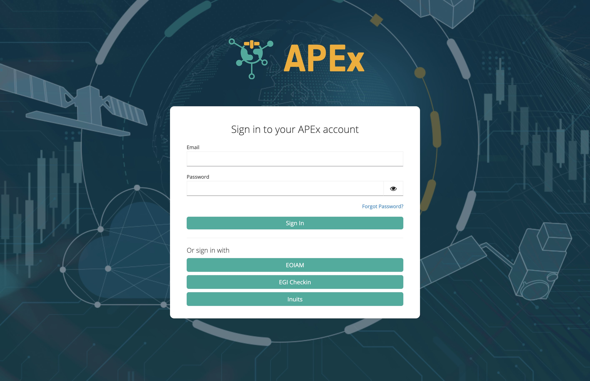
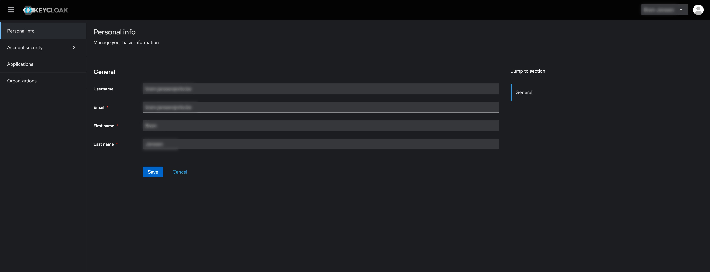
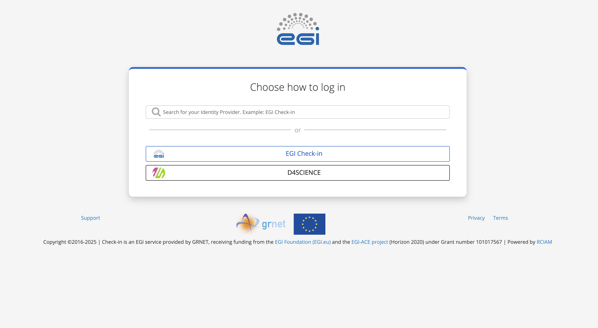
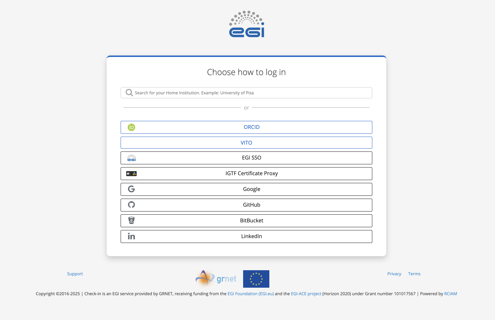

To access any of the APEx services, you will need to have a valid account on APEx.
Please follow the instructions below to create your account.

1. Navigate to the [APEx Account Dashboard](https://auth.apex.esa.int/realms/apex/account). This will present the APEx
   login page.

   

2. APEx only allows users to login by using an external identity provider. This means that you can use one of your many
   existing accounts to login and create your user profile on APEx. Select one of the options that are currently supported
   by APEx:
   - **ESA EOIAM**: This is the ESA internal identity provider. If you are an ESA employee, you can use your ESA
   credentials to login.
   - **EGI Check-in**: This provider allows you to use your institutional or social accounts to login and would be the
   preferred option for non-ESA users. More detailed information is available in the [next section](#login-with-your-institutions-account-using-egi-check-in).

3. Once you have you logged in using one of the above options, you should see your APEx Account Dashboard.

You have now successfully created an APEx account and are ready to use the APEx services. Whenever you are prompted to
login to APEx, you can use the same identity provider you used to create your account.

## Login with your institution's account Using EGI Check-in

EGI Check-in is an identity provider that allows you to use your institutional or social accounts to login to APEx. Because
of its flexibility and large range of possible identity providers, it is the preferred option for non-ESA users.
The following instructions will guide you through the process of logging in with your institution's account using EGI Check-in.

1. After clicking the EGI Check-in button on the APEx login page, you will be redirected to the EGI Check-in page.

    

2. Click the **EGI Check-in** button to proceed.
3. In this step you can select the provider you want to use to login. You can either select one of the providers from the
list or search for your provider using the search bar. EGI Check-in will remember your last used provider, so you can easily
select it again in the future.

    

4. Use your existing credentials to login to your selected provider.
5. If this is your first time using EGI Check-in, you will be asked to authorize EGI Check-in to access your account. Proceed
throughout EGI Check-in's onboarding process until you are redirected back to APEx.
