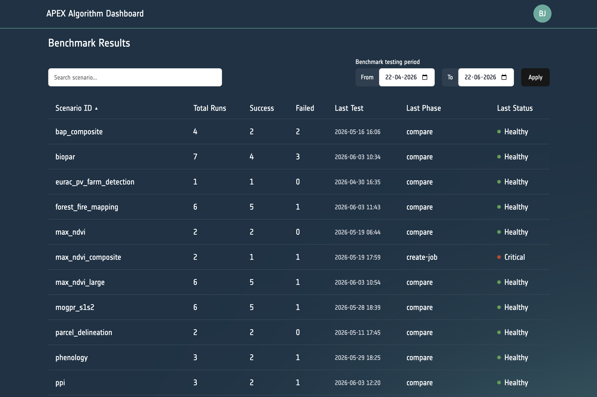
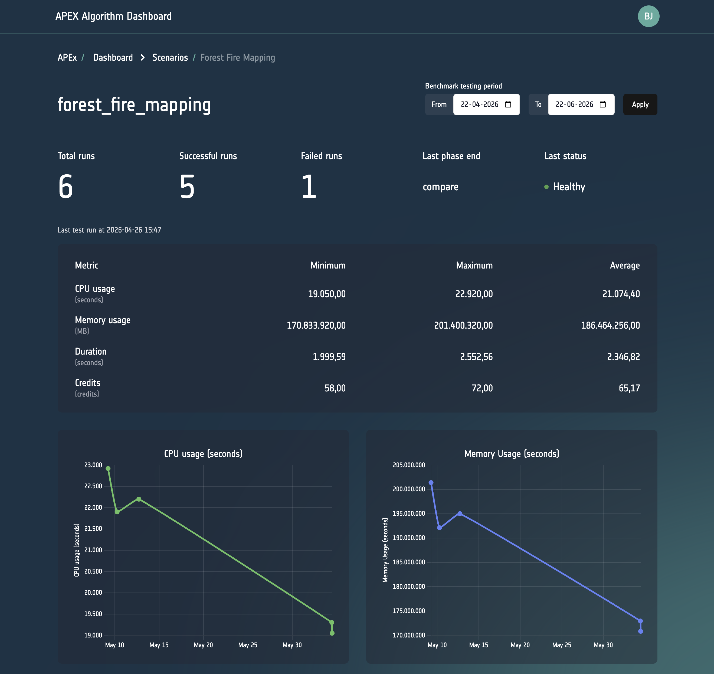

## Overview

The [**APEx Algorithm Dashboard**](https://algorithm-catalogue.apex.esa.int/dashboard) is a web-based administration
interface that is part of the broader [APEx Algorithm Catalogue](https://algorithm-catalogue.apex.esa.int/) application.
While the public-facing Algorithm Catalogue allows anyone to browse and discover algorithms that have been onboarded
onto APEx, the Algorithm Dashboard provides authorised users with deeper operational insight into those same
algorithms, including benchmark health, performance metrics, cost analytics, and scenario-level detail.

The Dashboard is intended primarily for **APEx operators, service administrators, and algorithm providers**
who need to monitor the operational status of registered services and diagnose issues beyond what is
visible in the public catalogue.

::: {.callout-note}
The public Algorithm Catalogue, available at <https://algorithm-catalogue.apex.esa.int/>, does not require
a login and is covered separately. This page focuses exclusively on the
[**Dashboard**](https://algorithm-catalogue.apex.esa.int/dashboard) (admin area), which requires authentication.
:::

## Key Capabilities

### Algorithm & Benchmark Overview

The Dashboard landing page presents a consolidated table of all algorithms registered in the catalogue
together with the current benchmark health status of each registered scenario.  For each algorithm the table
shows:

- Algorithm name and provider platform
- Benchmark status badge (`healthy`, `warning`, `critical`, or `no benchmark`)
- Number of test runs, success count, and failure count
- Date and phase of the most recent test run

Operators can use this view to spot at a glance which services are degraded or have never been benchmarked.

### Scenario-level Drill-down

Clicking on a row in the overview table navigates to a per-scenario detail page that contains:

- **Benchmark metrics table** — tabular view of individual test runs, including CPU (seconds),
  memory (MB-seconds), cost, duration (seconds), input pixel count (mega-pixels), maximum executor
  memory (GB), network received (bytes), and area size (km²).
- **Time-series line chart** — visualises how key metrics (e.g. duration, cost) evolve across
  successive test runs, making it easy to detect regressions.

::: {.callout-note}
The metrics shown in the Dashboard depend on the metrics provided by the algorithm hosting platform
where the benchmark is executed. Availability and precision of individual metrics may vary across platforms.
:::

### GitHub Notifications

Whenever a benchmark fails, a GitHub issue is automatically created on the
[APEx Algorithm Catalogue repository](https://github.com/ESA-APEx/apex_algorithms/issues?q=is%3Aissue%20state%3Aopen%20label%3Abenchmark)
to notify service providers and operators. These issues automatically include detailed diagnostic information to
facilitate rapid issue resolution:

- **Service parameters**: the configuration and parameters used for the failed benchmark execution
- **Execution details**: runtime information such as duration, resource utilization, and platform-specific metadata
- **Application logs**: complete error messages and application output from the failed run

This automated notification system ensures that failures are immediately communicated and that all necessary debugging
information is readily available without requiring a manual inspection.

### Date-range Filtering

Both the overview and the scenario detail pages support **date-range filtering** so that operators can focus on a
specific time window and compare periods.

### Benchmark Status Badges

Each algorithm and scenario is assigned a colour-coded status badge that summarises the outcome of the
most recent test run:

| Status           | Meaning                                                          |
| :--------------- | :--------------------------------------------------------------- |
| `healthy`        | The most recent test run completed successfully                  |
| `warning`        | A recent run finished with degraded performance                  |
| `critical`       | The most recent run failed                                       |
| `no benchmark`   | No test scenario has been registered for this algorithm yet      |

## Roles & Permissions

The Dashboard uses the APEx [Keycloak](https://www.keycloak.org/) for authentication.
For instructions on creating an APEx user account, see the [APEx User Account Guide](account.md).

Access to the Dashboard is configured through the `acl` (access control list) property on the corresponding
Provider record in the APEx Algorithm Catalogue. More information is available in our
[APEx Algorithm Catalogue Guide](./algorithm_services_catalogue.qmd)

## Requesting Access

### Who Can Request Access

Dashboard (admin) access is intended for:

- **APEx team members and operators** responsible for maintaining the Algorithm Catalogue
- **Algorithm providers** who need detailed diagnostic information about the health of their own
  registered services and who cannot resolve an issue using the public benchmark status alone
- **ESA staff or project partners** with a justified need to inspect benchmark data across multiple
  algorithms

If you only need to **browse or discover algorithms**, you do not need Dashboard access, the public
[APEx Algorithm Catalogue](https://algorithm-catalogue.apex.esa.int/) is openly accessible without
any login.

### How to Request Access

Access to a provider's services can be requested by creating an issue on the [APEx Algorithm Catalogue repository](https://github.com/ESA-APEx/apex_algorithms).
