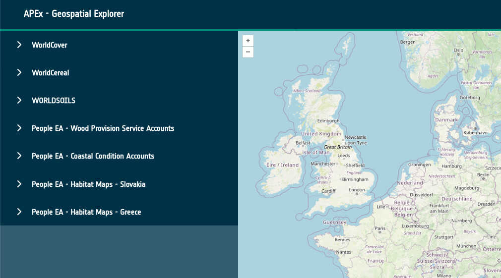
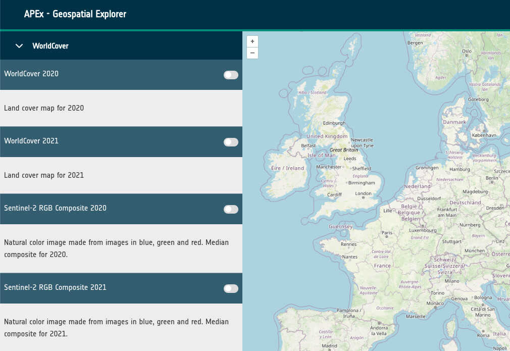
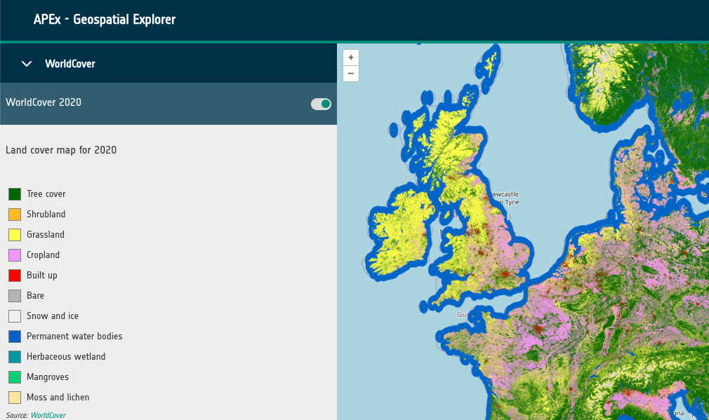
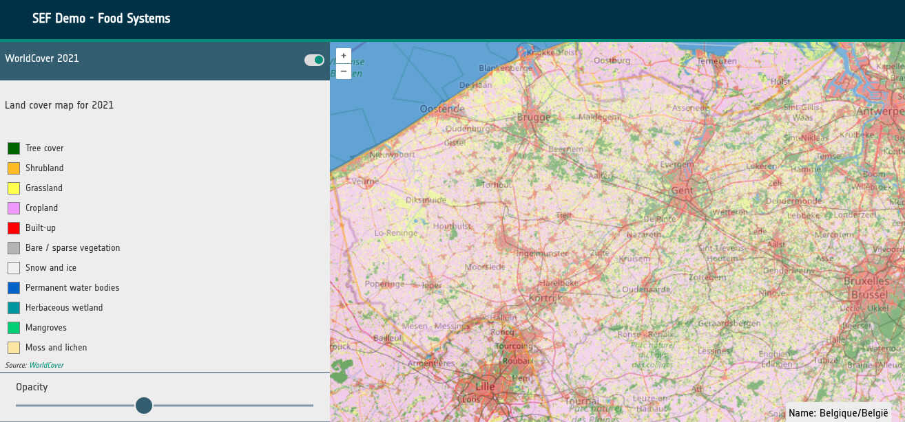
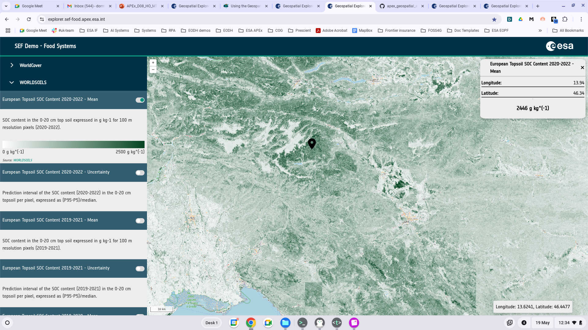
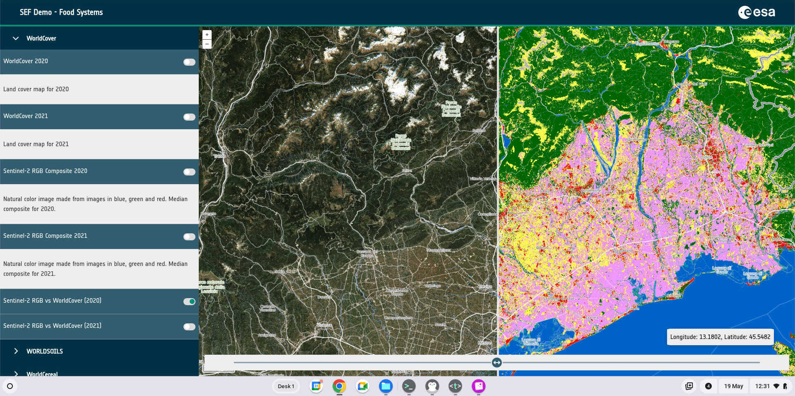
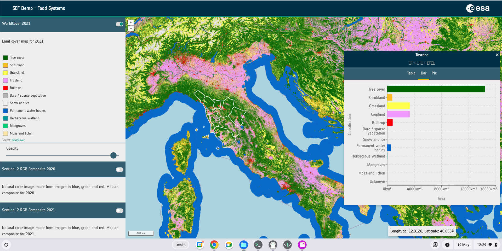

The [**APEx Geospatial Explorer**](../instantiation/geospatial_explorer.md) is a web map application with a configurable
user interface that can be used to showcase the results of ESA projects as interactive maps, tables and charts.  This user
guide provides some general user guidance for a number of supported features.

:::{.callout-note}
Users should be aware that the configuration of any specific Geospatial Explorer page will determine
what is available on a case by case basis.  Examples of instantiated versions of the Geospatial Explorer are
listed [here](../instantiation/geospatial_explorer.md#examples) on the project overview page.
:::

## Navigating around the map

There are a number of options for navigating around the map:

:::{.callout-tip}

## You can

* Use the "+" and "-" icons on the map to zoom in and out
* Double click on the map to zoom in
* Hold "shift" and double click on the map to zoom out
* Hold "shift" and draw a rectangle on the map to zoom to a specific area
of interest
* Click and drag on the map to pan *Hold "alt", "shift" then click and drag on the map to rotate*
* Click on the arrow in the top right to reset the map to north up
:::

A **scale bar** of your map view is visible in the bottom left of the map, and the **latitude** and **longitude**
of your current cursor location at the bottom right.

## Layer groups and layers

The left hand panel of the Geospatial Explorer is used to add data to the map.  Typically data is organised into
**layer groups**.

Clicking on a specific layer group expands the layers within that group and displays a brief description of what
that layer comprises.

To add the data on to the map, use the toggle button. Once a layer is toggled on the layer panel will expand to
show you more information about the layer - for example, a legend to help you interpret the map.  If it has been
configured you may also see an attribution link, which may link you out to a project page or metadata record about
the layer.  The example below has been linked to the **World Cover** website.

In some cases, according to how the explorer has been configured **switching one layer on may switch others off**.
These *mutually exclusive* groups are often set up when it only makes sense to show one layer at a time, because
viewing one layer would completely obscure another layer in the group.

## Layer opacity

In some circumstances a layer may have been configured to include an **opacity** control.  This gives you a slider
that allows you to change the level of opacity to make the layer partially transparent, allowing you to view other
map layers (such as background mapping) beneath the layer.

## Layer "info" box

For some layers (such as the **European Top Soil Layers** in the [SEF Food
Demo](https://explorer.sef-food.apex.esa.int/)) clicking on the map drops a marker and displays an "info" box of
the *latitude, longitude* and *data value* at the marker location, allowing you to display the precise value of
the data at that point.

## Split screen view

The Geospatial Explorer also allows different layers to be compared in a **split screen** view.  In the current
release of the explorer, these comparison layers are defined in the configuration for a given explorer, but in
a future release it will be possible for you to choose your own pair of layers to view in a split screen mode.
When you are in a split screen mode, the slider at the bottom of the map allows you to "swipe" from left to right
to compare the two layers with one another.

## Statistics

Statistical data can also be displayed in the Geospatial Explorer as tables, charts and graphs.  These statistics are
*pre-computed* for performance reasons, to specific boundary areas.  These could be administrative (e.g. national,
regional or local boundaries) or natural (e.g. river basins).  The statistics that are available will depend on
what the administrator of the Geospatial Explorer has defined for you.

To access these, simply *click on a polygon* to display the statistics panel and then select from the table,
bar or pie chart options.

In some cases, there may be a hierarchy of boundaries available, allowing users to *"drill down"* from national
to regional to local levels.  Each time a boundary is selected, the set of available boundaries at the next tier
down are displayed.

You will also notice that the statistics panel then contains a *"breadcrumb"* view of the boundaries.  You can
navigate back up through your hierarchy by clicking on elements within the breadcrumb view.
