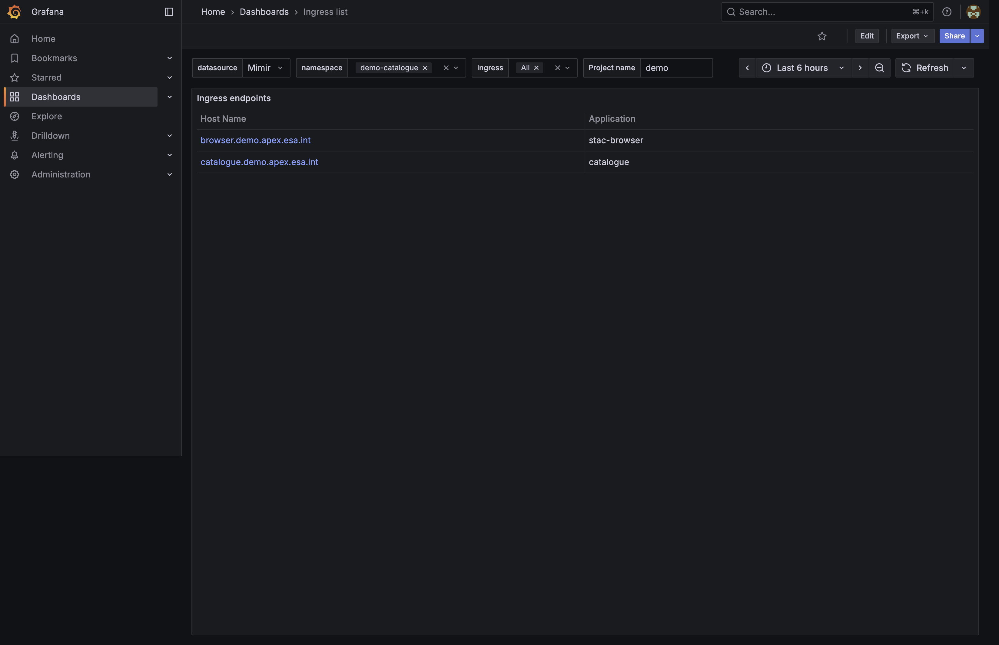
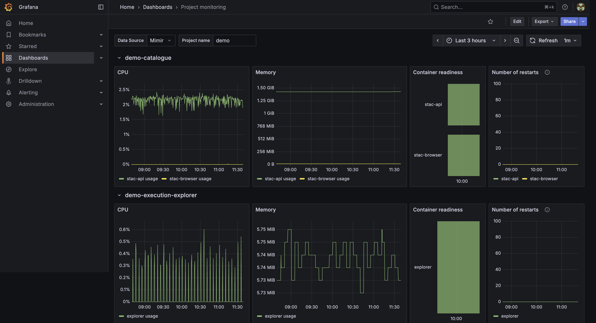

## Overview

APEx provides Grafana dashboards for project-level operational monitoring.
The Grafana instance for each project follows this URL pattern:

- `https://grafana.<project>.apex.esa.int/`

Example:

- [https://grafana.demo.apex.esa.int/](https://grafana.demo.apex.esa.int/)

This guide explains how to access the dashboards and what information is available.

## Access and Authentication

To access Grafana:

1. Open your project URL, for example `https://grafana.demo.apex.esa.int/`.
2. Select **Sign in with APEx SSO** on the Grafana login page.
3. Complete authentication using your APEx account.

If you do not yet have an APEx account, follow the
[Creating an APEx account guide](account.md).

Note that having an APEx account is required but not sufficient on its own.
Your account must also be explicitly authorised for the target project environment.

If authentication succeeds but you do not see your project dashboards,
request environment access through APEx support.

## Available Dashboards

Two dashboards are available for day-to-day operational monitoring:

- **Ingress list**
- **Project monitoring**

### Ingress list dashboard

The Ingress list dashboard provides a quick inventory of exposed endpoints
for your namespace/project.

Main capabilities:

- Lists ingress host names currently configured for the selected project.
- Shows which application each host name routes to.
- Supports filtering by datasource, namespace, ingress name, and project name.
- Supports standard Grafana time-window filtering for recent changes.

Use this dashboard when you need to:

- confirm the public host name of a deployed service,
- verify whether a specific endpoint exists,
- cross-check which component is behind a given ingress host.

### Project monitoring dashboard

The Project monitoring dashboard provides workload health and usage indicators
for core deployed components in the project namespace.

Main capabilities:

- CPU usage trends per component.
- Memory usage trends per component.
- Container readiness overview.
- Restart counters to detect instability.
- Per-project filtering to focus on one environment.

Use this dashboard when you need to:

- check whether services are healthy and ready,
- identify resource pressure (CPU or memory growth),
- investigate recurring restarts,
- validate platform state during incident triage.

## Tips

- Start with **Ingress list** to validate endpoint routing.
- Continue with **Project monitoring** to inspect runtime health.
- Keep the dashboard time range aligned with the time of an observed issue.
