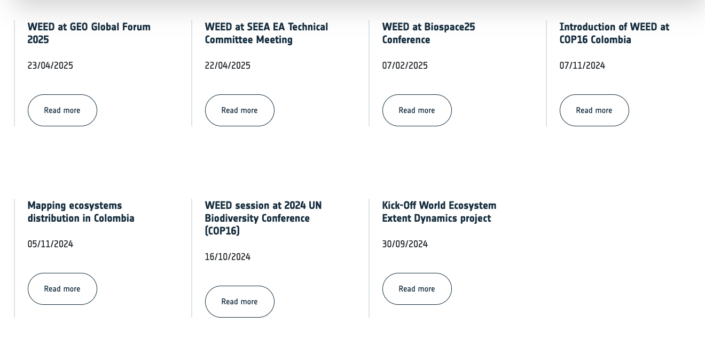
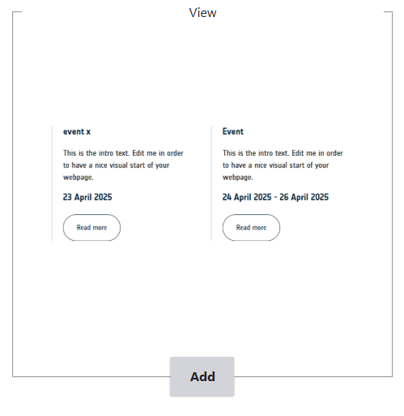
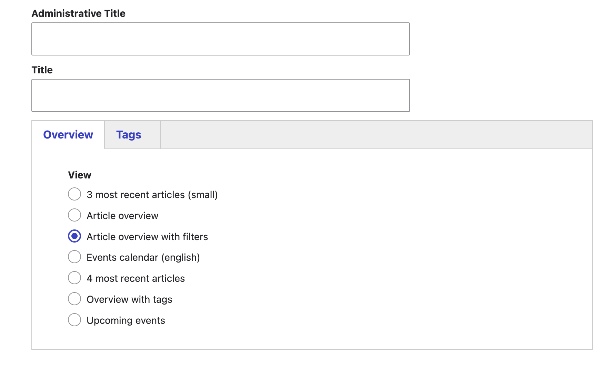
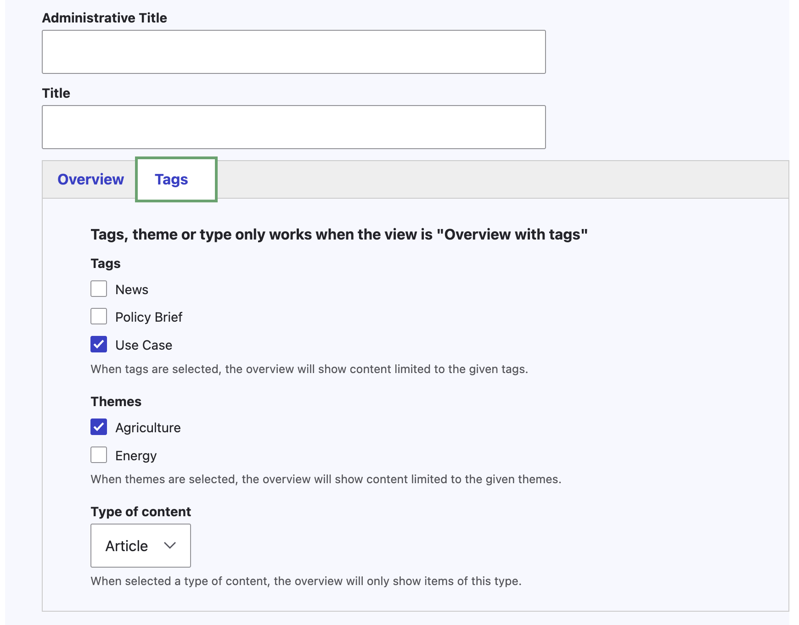
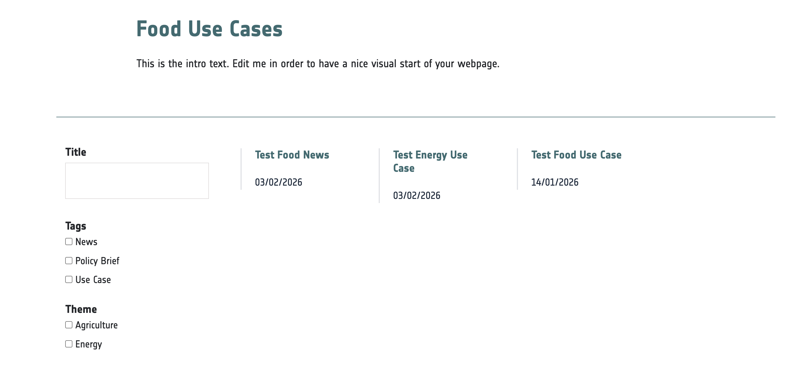
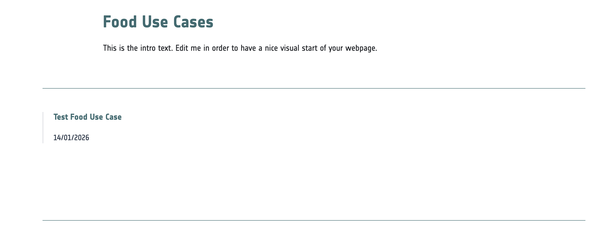

The Project Web Portal allows you to create news items and display them in overview lists.
You can publish a full overview on a dedicated page, or add a **News** paragraph to any page to show the latest items.

## Add a news item

To create a news item, open the **Content** menu in the navigation toolbar and select **Article**.
You can then start building your news page.

## Add the latest news on the home page

You can add the latest news items to the home page, or to any other page, by using the **View** paragraph.
In the paragraph settings, you can choose how many recent items are shown. To display the latest articles, use one of the
following options:

- Show the 3 most recent articles
- Show the 4 most recent articles

## Add a news overview based on themes or tags

Besides showing the latest news on the home page, you can also add a filtered news overview.
This overview can be filtered by a specific theme or tag, or it can display all items with a filter for tags and themes.
For this to work, your content must be tagged correctly. More detailed instructions are available
[here](./8_tags_themes.qmd#adding-a-tag-or-theme-to-a-page).

To do this, add a **View** paragraph to your page. On the overview page, the following options are relevant:

- **Overview with tags**: Defines filtering based on the settings in the **Tags** tab.
- **Article overview with filters**: Displays all articles and news items and adds a filter so users can filter by tag
and theme.

## Add a news overview web page

To add a separate page with a more complete overview of all news items, create a basic page, add the **View** paragraph,
and select **Article overview** or **Article overview with filters**.

## Screenshots

::: {style="display: grid;grid-template-columns: repeat(auto-fill, minmax(500px, 1fr));grid-gap: 1em;"}
{group="gallery-news"}

{group="gallery-news"}

{group="gallery-news"}

{group="gallery-news"}

{group="gallery-news"}

{group="gallery-news"}

{group="gallery-news"}

:::
