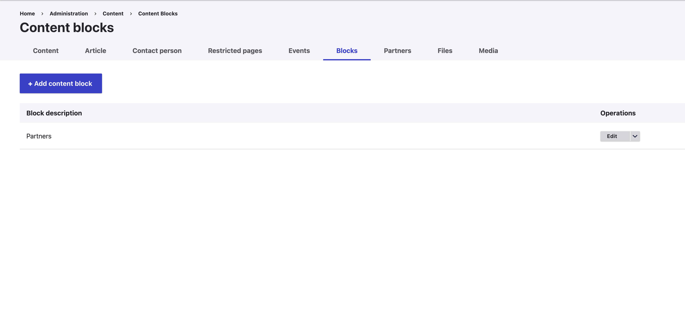
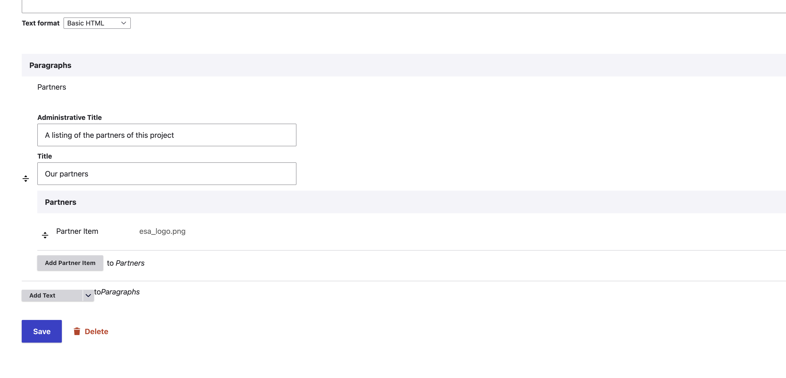

In the current template of the APEx Project Web Portal, a dedicated “Our Partners” section is included on each webpage.
This section displays the logos of the partners involved in your project.

### Changing the logos

You can change the logos in this section by executing the following steps:

1. In the administration menu of your Project Web Portal, go to **Contents > Blocks**.
2. Locate the **Partners** block.
3. Click **Edit** for the Partners block.
4. In the block configuration page, you can:
   * Update the title of the section.
   * Modify the partner logos in the Paragraphs section.
5. After making your changes, click **Save** to apply them.

Your updates will now be reflected in the “Our Partners” section across the website.

### Removing the block

You can remove the partners block by executing the following steps:

1. In the administration menu of your Project Web Portal, go to **Contents > Blocks**.
2. Locate the **Partners** block.
3. Click **Remove** for the Partners block.

## Screenshots

::: {style="display: grid;grid-template-columns: repeat(auto-fill, minmax(500px, 1fr));grid-gap: 1em;"}

{group="gallery-manage-partners"}

{group="gallery-manage-partners"}

:::
