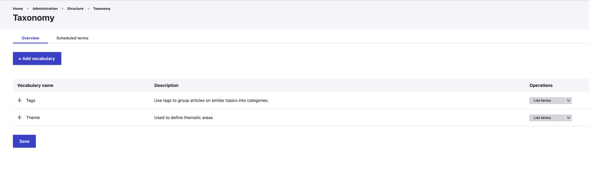
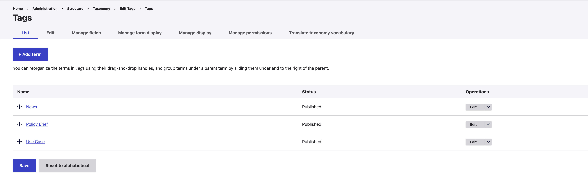
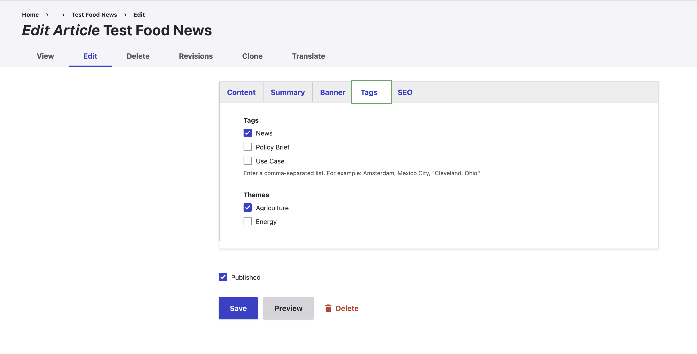

The APEx Project Web Portal lets you organize article and news content using tags and themes.
As a web content administrator, you can use these taxonomies to create custom views that filter content based on one or
more selected tags and themes. Tags and themes are fully configurable, so each project remains in control.

### Managing tags and themes

To manage tags and themes:

1. In the administration menu of your Project Web Portal, go to **Structure > Taxonomy**.
2. For either **Tags** or **Themes**, click **List terms** for the corresponding taxonomy.
3. You can now add, edit, or delete terms in both taxonomies.

### Adding a tag or theme to a page

Once you have created the taxonomy, you can start applying tags and themes to your page. This can be done
by the following steps:

1. Find the article or new item to which you want to apply the tag or theme through the **content** menu.
2. On the top of your editing page, you will see a **Tags** tab where you can enable tags and themes for the page.
3. Click **Save** to ensure your selection is applied.

### Filtering content based on tags or themes

Tags and themes allow you to filter the content displayed in news and article overviews on your page.
For detailed instructions, see:

* [Add news items and an overview of the latest or all news](./3c_news.qmd)

## Screenshots

::: {style="display: grid;grid-template-columns: repeat(auto-fill, minmax(500px, 1fr));grid-gap: 1em;"}

{group="gallery-taxonomy"}

{group="gallery-taxonomy"}

{group="gallery-taxonomy"}

:::
