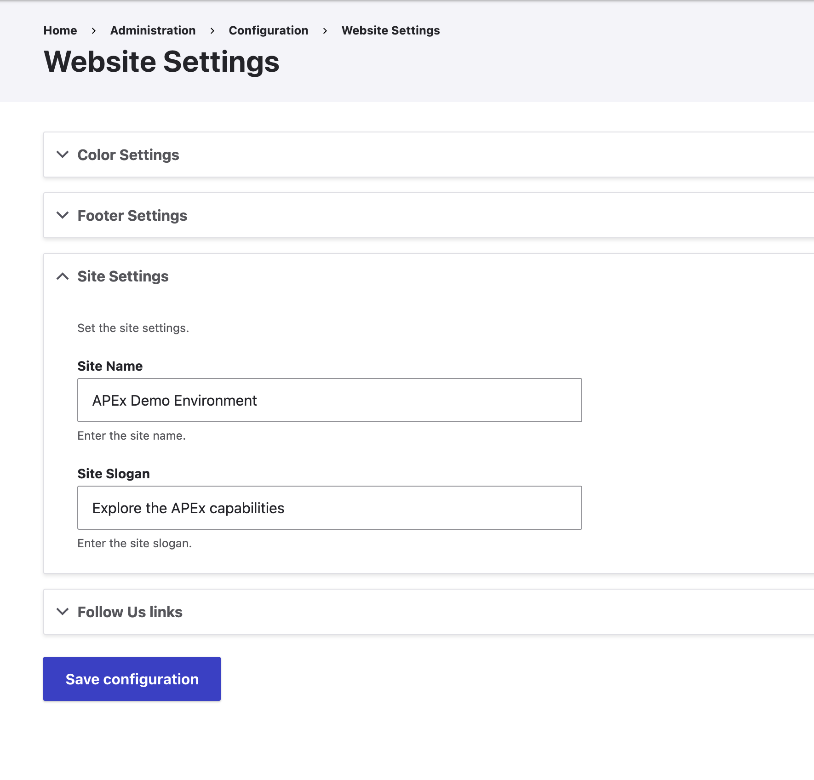

When you first open an APEx Project Web Portal, it uses a default site name and slogan.
You can update these settings by following the steps below:

1. In the administration menu, go to **Website Settings**.
2. Open **Site Settings** and update the site name and slogan.
3. Click **Save configuration** to apply your changes.

## Screenshots

::: {style="display: grid;grid-template-columns: repeat(auto-fill, minmax(500px, 1fr));grid-gap: 1em;"}

{group="gallery-settings"}

:::
