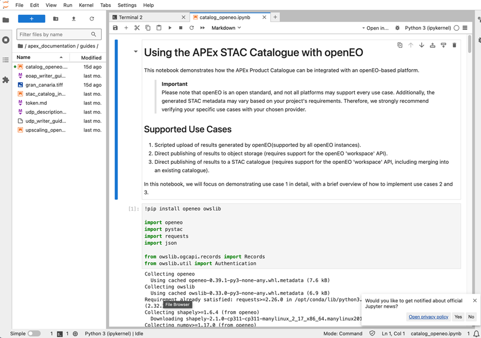

## Overview

The JupyterLab Interactive Development Environment (IDE) capacity within the APEx Project Environments primarily leverages the power
of the [JupyterLab](#jupyterlab-software-architecture) software.

This APEx tailored User Workspace allows users to maintain a familiar environment and rich feature set while benefiting
from the power and resources of server-side computing. This is particularly advantageous for those working on resource-intensive
tasks or needing access to a consistent development environment from various locations and devices.

The server-based nature ensures that developers are not constrained by their local machine's hardware capabilities, allowing
them to harness the computational power of remote servers.

Tailored specifically for EO tasks, this environment furnishes developers with an array of tools and libraries fine-tuned
for programming languages and productivity plugins or extensions.

## Software Architecture

The JupyterLab setup encapsulates a web-based interactive development environment for Jupyter notebooks, code, and data.
It is the user interface for Project Jupyter, offering a flexible user interface and more features than the classic notebook
UI. It is a web application providing a development environment in which processing algorithms and services can be developed,
tested, and debugged.

JupyterLab supports execution environments (called "kernels") in several dozen languages, including
Julia, R, Haskell, Ruby, and Python (via the IPython kernel). It seamlessly adapts to containerised environments, enabling
developers to create, test, and deploy applications within isolated, replicable, and consistent environments, ensuring
consistent behaviour across development, staging, and production phases.

## Key Features

The APEx JupyterLab IDE includes several features that make it suitable for both individual researchers and teams
working on EO research and applications.

* **Customisable workspaces**\
Configure your workspace with tools and settings tailored to your specific needs, including debugging tools, data analysis,
and data visualisation, as well as a plethora of extensions for JupyterLab from the PyPl.org registry.
* **EO-focused tools**\
Access integrated libraries like SNAP and GDAL, which are specifically designed for Earth observation tasks.
* **Support for every major programming language**\
Native support for over 40 preinstalled execution environments (called "kernels") including Python, R, Julia, Scala, Haskell
and Ruby, complemented by a vast repository of additional kernels maintained by the open source software community with
various levels of support.
* **Remote development and collaborative work**\
Leverage integrated Git support, allowing team members to work on the same project by tracking changes and merging updates,
helping to keep the code organized while avoiding conflicting code changes.

## Showcase Scenarios

The APEx JupyterLab IDE supports a variety of use cases, making it an essential tool for developers,
researchers, and data scientists within the EO community. Some typical scenarios include:

* **Algorithm Development and Testing**\
Researchers and developers can write, test, and debug new algorithms for processing
satellite imagery or other EO data. For instance, a user might develop a script to detect deforestation using
multi-temporal satellite images. To support the productivity of developers, both the JupyterLab solution use a mechanism of extensions.

::: {.callout-note}
There is no GitHub Copilot extension available yet for JupyterLab.

See the [Code Server IDE](./app_code_server.md) page for more details on CoPilot extensions.

:::

* **Collaborative Projects**\
Teams can work collaboratively on projects, sharing code and resources in real-time. A group
of data scientists might collaboratively develop a machine-learning model to predict crop yields based on various data
inputs.

* **Data Science Notebooks**\
The term "Notebook" usually covers two different concepts, either the user-facing application
to edit code and text (this originates from Project Jupyter‘s software product initially branded "Jupyter Notebooks",
nowadays "JupyterLab"), or more commonly the underlying file format which is interoperable across many IDE software
solutions. Both solutions proposed for APEx, Code Server, and JupyterLab have multi-kernel language support (python, R,
Ruby, ...). Code Server supports local development of Jupyter Notebooks: the Jupyter extension for VS Code is a very
popular extension in the VS Code Marketplace. JupyterLab is a very popular tool within the Open Science community for
working with notebooks, with its native support for data science, data visualisation and reproducible environments.

## Examples

@tbl-ide-examples showcases example projects that utilize the APEx JupyterLab IDE.

It is important to note that a valid APEx account and permissions from the project are required to access an environment.

| Project                         | URL                                                                                        |
| :------------------------------ | :----------------------------------------------------------------------------------------- |
| APEx (Demo)                     | [https://apphub.demo.apex.esa.int/](https://apphub.demo.apex.esa.int/)                     |
| SEF - Food Systems              | [https://apphub.sef-food.apex.esa.int/](https://apphub.sef-food.apex.esa.int/)             |
| SEF - Ecosystems & Biodiversity | [https://apphub.sef-ecosystems.apex.esa.int/](https://apphub.sef-ecosystems.apex.esa.int/) |

: APEx JuyterLab IDE - Project Examples {#tbl-ide-examples}{tbl-colwidths="[20,80]"}

:::{.callout-tip}

## Stay Tuned

Additional information will be shared on this page as the project progresses.
:::
