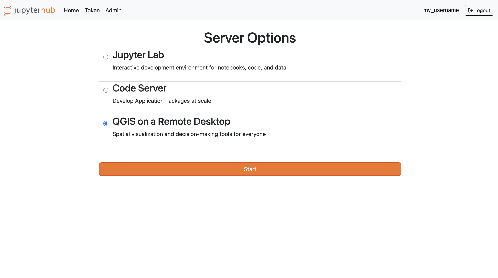

## Overview

The Geographic Information System capacity within the APEx Project Environments primarily leverages the power
of the [QGIS software](#qgis-software-architecture) as a Remote Desktop software.

This APEx tailored User Workspace allows users to maintain a familiar environment and rich feature set while benefiting
from the power and resources of server-side computing. This is particularly advantageous for those working on resource-intensive
tasks or needing access to a consistent development environment from various locations and devices.

The server-based nature ensures that users are not constrained by their local machine's hardware capabilities, allowing
them to harness the computational power of remote servers.

## QGIS software architecture

The APEx QGIS workspace is a fully-fledged Geographic Information System delivered as a cloud-based user workspace, tailored
to support the activities of Earth observation (EO) projects.  

Each QGIS workspace comes equipped with the free and open source software project hosted on QGIS.org association, as well
as with a private data products catalogue. These features empower developer users to edit and build EO-based mapping products 
and geospatial workflows, accelerating project outcomes within a dedicated, tool-rich environment.

### Key Features

The APEx QGIS workspace includes several features that make it suitable for both individual researchers and teams working
on EO research and applications.

* **Customisable workspaces**\
Configure your workspace with tools and settings tailored to your specific needs, including geographic features digitising
tools, geospatial analysis workflows and map production options, as well as advanced functions from a plethora of 2000+
plugins developed by the QGIS community.
* **EO-focused tools**\
Access specialised plugins such as for raster data analysis, or for visualisation of multi-sensor time series, all
specifically designed for Earth observation tasks.
* **Support for every major GIS toolbox**\
Native support for a wide range of geospatial data management toolboxes, including GRASS and GDAL.
* **Collaborative work**\
Store, manage, and share QGIS projects with the ability to connect to external data sources as needed.

## Showcase Scenarios

* **Collaborative Projects**\
Teams can work collaboratively on GIS projects, sharing data and resources in real-time. A group
of data scientists might collaboratively develop crop yields scenario maps based on various data inputs.

## Examples

Several examples are under development and will be added on this page.

| Project                         | URL                                                                                        |
| :------------------------------ | :----------------------------------------------------------------------------------------- |
| APEx (Demo)                     | [https://apphub.demo.apex.esa.int/](https://apphub.demo.apex.esa.int/)                     |
| SEF - Food Systems              | [https://apphub.sef-food.apex.esa.int/](https://apphub.sef-food.apex.esa.int/)             |
| SEF - Ecosystems & Biodiversity | [https://apphub.sef-ecosystems.apex.esa.int/](https://apphub.sef-ecosystems.apex.esa.int/) |

: APEx QGIS - Project Examples {#tbl-qgis-examples}{tbl-colwidths="[20,80]"}

:::{.callout-tip}

## Stay Tuned

Additional information will be shared on this page as the project progresses.
:::
