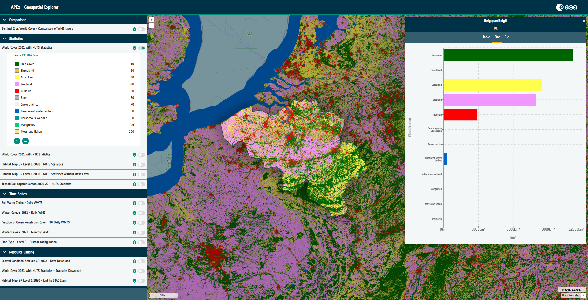
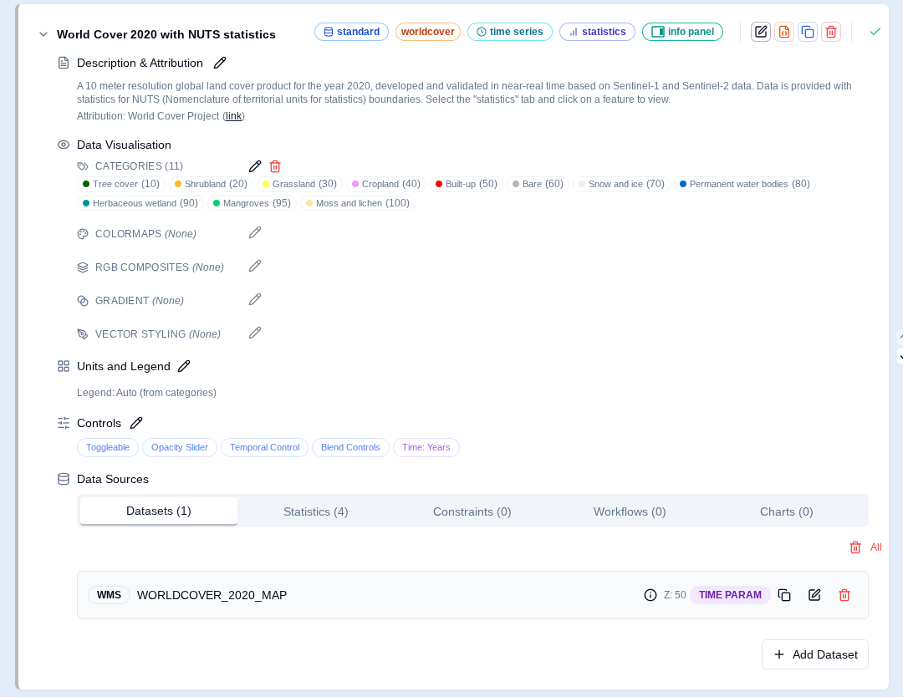

## Overview

The Geospatial Explorer provides an interactive web front end that can be used for the display and visualisation of
geospatial and tabular data ingested from web services following common interoperable protocols (e.g. OGC Standards,
STAC, etc.). The Explorer is data-driven, allowing administrators to define its configuration in
JSON (i.e. the data layers and functional operations possible for each layer). This configuration determines how the
user interface is rendered at run time and the resulting data and functionality that is exposed to the end user.

Typical functions will include the ability to visualise EO data, derived products and associated vector layers (e.g.
administrative boundaries), with control over layer ordering, transparency, product comparisons (split screen) and
support for features such as cursor inspection, queries, distance measurements and visualisation of tabular data via
integrated charts and graphs. The UI will also provide access to metadata records associated with the data that is
rendered in the Explorer.

## Geospatial Explorer Configuration Builder

Maintenance of the Geospatial Explorer JSON configuration files can be undertaken using the GE Configuration Builder,
a web based application that allows in browser JSON editing via bespoke User Interface, thereby negating the need for
configuration “authors” to learn how to produce valid JSON, or understand the specifics of the GE schema.

The GE Configuration Builder development is done in parallel to the GE, with Configuration Builder feature kept in line
with the schema of the latest GE release, and potentially multiple Configuration Builder enhancements being undertaken
between GE releases.

Features of the configuration builder include:

* Compose an APEx Geospatial Explorer configuration from data sources and services (WMTS, WMS, WFS, COG, XYZ, GeoJSON,
FlatGeoBuf, CSV) using layers organised into interface groups
* Define the background maps that are available
* Style raster layers with categories and colormaps, build RGB composites and style vector layers with rule-based filters
and stops.
* Define statistics and constraint layers
* Author charts from CSV, COG pixel values, or vector feature properties.
* Configure specific functional controls for each layer - e.g opacity slider, download links
* Browse remote catalogues with the STAC and S3 browsers.
* Inspect the metadata of data sources to understand their content
* Validate every URL in your config with the Run Healthcheck tool and see data-access plus performance scores at a glance.
* Define specific branding and navigation defaults (e.g. projection; start location and scale)
* Preview the resulting APEx Geospatial Explorer inline using GE Preview before exporting JSON.

## Examples

Explore the different Geospatial Explorer examples through our
[Solutions Gallery](https://apex.esa.int/resources/solutions-gallery?field_services=Geospatial+Explorer).

## User Guide

For a general overview of features, take a look at the [Geospatial Explorer User Guide](../guides/geospatial_explorer/geospatial_explorer_guide.qmd).
To learn how to manage and configure your own Geospatial Explorer, refer to this [administration guide](https://esa-apex.github.io/apex_documentation/guides/geospatial_explorer/).

## Recommendations

To learn more about the specific recommendations for the usage and the configuration of the Geosplace Explorer, please
refer to the our [APEx Geospatial Explorer Recommendations](../interoperability/geospatial_explorer.qmd) page.

## Example Configurations

Numerous example configurations can be found in the
[APEx Geospatial Explorer Configurations](https://github.com/ESA-APEx/apex_geospatial_explorer_configs) repository on GitHub.
