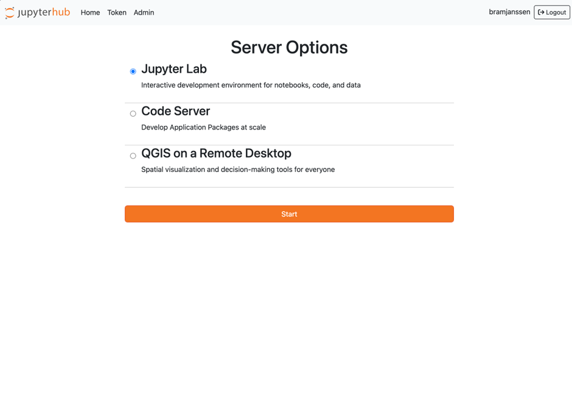
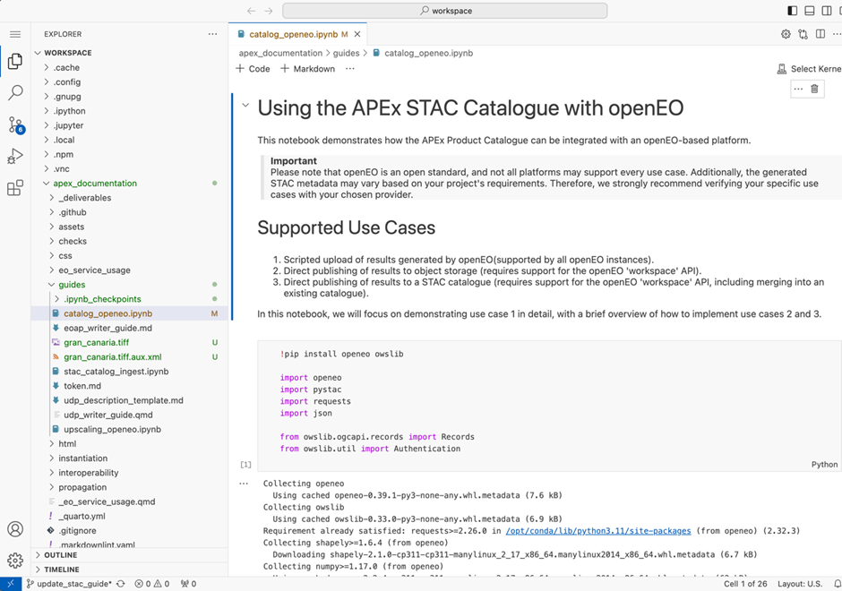
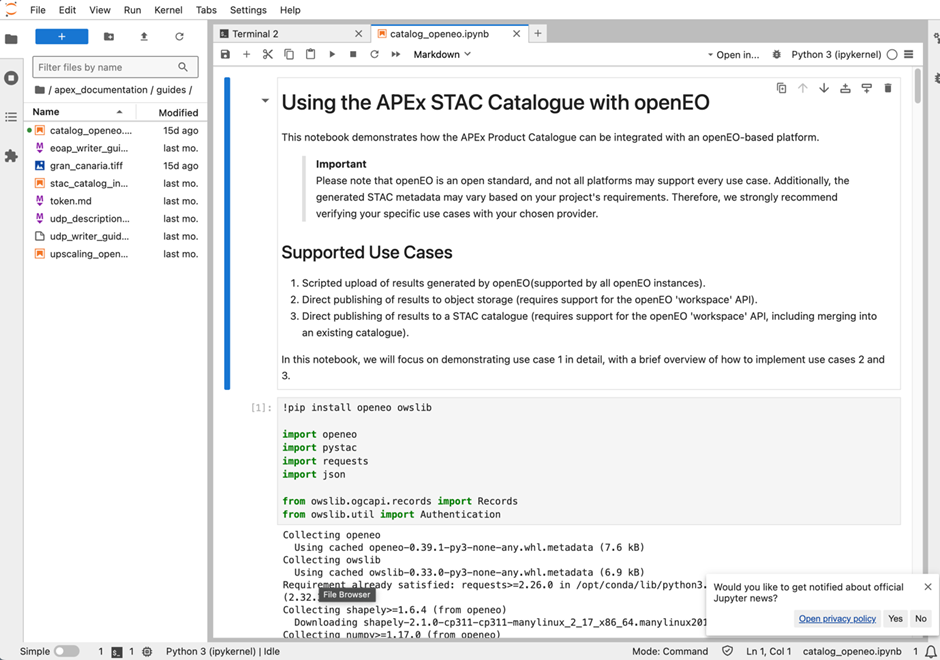
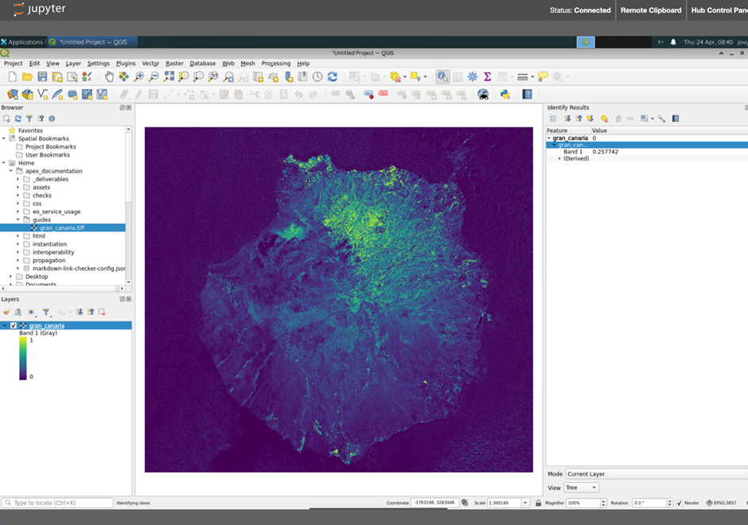

## Overview

The Interactive Development Environment (IDE) capacity within the APEx Project Environments primarily leverages the power
of the [Code Server software (Visual Studio Code in the Cloud)](#code-server), and of the [JupyterLab](#jupyterlab) software.
The Geographic Information System (GIS) capacity leverages [QGIS](#qgis) as a Remote Desktop software.

These APEx User Workspace services allow users to maintain a familiar environment and rich feature set while benefiting
from the power and resources of server-side computing. This is particularly advantageous for those working on resource-intensive
tasks or needing access to a consistent development environment from various locations and devices.

The server-based nature ensures that developers are not constrained by their local machine's hardware capabilities, allowing
them to harness the computational power of remote servers.

Tailored specifically for EO tasks, this environment furnishes developers with an array of tools and libraries fine-tuned
for programming languages and productivity plugins or extensions

## Code Server

The APEx Code Server solution is an Integrated Development Environment delivered as a cloud-based user workspace, tailored
to support the activities of Earth observation (EO) projects.  

The Code Server IDE within the APEx Instantiation Services is built on the [User Workspace](./user_workspace.md) architecture,
leveraging Kubernetes and JupyterHub for orchestration and management.

Each Code Server workspace comes equipped with the Visual Studio Code Server, an extension of Microsoft's popular VS Code
editor, as well as with a private data products catalogue. These features empower developer users to edit and build EO
data processing algorithms and workflows, accelerating project outcomes within a dedicated, tool-rich environment.

The Code Server setup encapsulates all the capabilities of Microsoft's popular VS Code editor and extends them to be run
and accessed on a remote server. Beyond the core functionality of its desktop counterpart, the Code Server IDE offers
additional features tailored for remote development, such as integrated Git support, debugging tools, and a plethora of
extensions (for Code Server, from the VS Code Marketplace and for JupyterLab, from the PyPI.org registry). It provides
support for programming languages like Python, R, and Java. Key libraries such as SNAP and GDAL are integrated, providing
robust capabilities for EO data discovery, access, processing, and analytical needs.

It seamlessly adapts to containerised environments, enabling developers to create, test, and deploy applications within
isolated, replicable, and consistent environments, ensuring consistent behaviour across development, staging, and production
phases.

Code Server forms the core development environment, delivering a comprehensive code editing and debugging interface. This
server-based IDE allows developers to maintain the familiar environment and feature set of VS Code while benefiting from
the power and resources of server-side computing. The server-based nature ensures that developers are not constrained by
their local machine's hardware capabilities, enabling them to leverage the computational power of remote servers.

Code Server serves as the core development environment, providing a powerful and flexible platform for coding and debugging,
allowing developers to harness server-side computational power while maintaining a familiar interface.

### Key Features

The APEx Code Server workspace includes several features that make it suitable for both individual researchers and teams
working on EO research and applications.

* **Customisable workspace**\
Configure your workspace with tools and settings tailored to your specific needs, including debugging tools and machine
learning, as well as a plethora of extensions for Code Server from the VS Code Marketplace.

* **EO-focused tools**\
Access integrated libraries like SNAP and GDAL, which are specifically designed for Earth observation tasks.

* **Support for every major programming language**\
Native support for a wide range of programming languages, including JavaScript, TypeScript, CSS, HTML, C++, C#, and Python,
complemented by a vast repository of extensions for virtually any language or file format (Java, Go, PHP, Ruby, ...)

* **Remote development and collaborative work**\
Leverage integrated Git support, allowing team members to work on the same project by tracking changes and merging updates,
helping to keep the code organised while avoiding conflicting code changes.

## JupyterLab

The JupyterLab setup encapsulates a web-based interactive development environment for Jupyter notebooks, code, and data.
It is the user interface for Project Jupyter, offering a flexible user interface and more features than the classic notebook
UI. It is a web application providing a development environment in which processing algorithms and services can be developed,
tested, and debugged. JupyterLab supports execution environments (called "kernels") in several dozen languages, including
Julia, R, Haskell, Ruby, and Python (via the IPython kernel). It seamlessly adapts to containerised environments, enabling
developers to create, test, and deploy applications within isolated, replicable, and consistent environments, ensuring
consistent behaviour across development, staging, and production phases.

### Key Features

The APEx JupyterLab workspace includes several features that make it suitable for both individual researchers and teams
working on EO research and applications.

* **Customisable workspaces**\
Configure your workspace with tools and settings tailored to your specific needs, including debugging tools, data analysis,
and data visualisation, as well as a plethora of extensions for JupyterLab from the PyPl.org registry.
* **EO-focused tools**\
Access integrated libraries like SNAP and GDAL, which are specifically designed for Earth observation tasks.
* **Support for every major programming language**\
Native support for over 40 preinstalled execution environments (called "kernels") including Python, R, Julia, Scala, Haskell
and Ruby, complemented by a vast repository of additional kernels maintained by the open source software community with
various levels of support.
* **Remote development and collaborative work**\
Leverage integrated Git support, allowing team members to work on the same project by tracking changes and merging updates,
helping to keep the code organized while avoiding conflicting code changes.

## QGIS

The APEx QGIS workspace is a fully-fledged Geographic Information System delivered as a cloud-based user workspace, tailored
to support the activities of Earth observation (EO) projects.  

Each QGIS workspace comes equipped with the free and open source software project hosted on QGIS.org association, as well
as with a private data products catalogue. These features empower developer users to edit and build EO data processing
algorithms and workflows, accelerating project outcomes within a dedicated, tool-rich environment.

The APEx QGIS workspace includes several features that make it suitable for both individual researchers and teams working
on EO research and applications.

* **Customisable workspaces**\
Configure your workspace with tools and settings tailored to your specific needs, including geographic features digitising
tools, geospatial analysis workflows and map production options, as well as advanced functions from a plethora of 2000+
plugins developed by the QGIS community.
* **EO-focused tools**\
Access specialised plugins such as for raster data analysis, or for visualisation of multi-sensor time series, all
specifically designed for Earth observation tasks.
* **Support for every major GIS toolbox**\
Native support for a wide range of geospatial data management toolboxes, including GRASS and GDAL.
* **Collaborative work**\
Store, manage, and share QGIS projects with the ability to connect to external data sources as needed.

## Showcase Scenarios

The Interactive Development Environment supports a variety of use cases, making it an essential tool for developers,
researchers, and data scientists within the EO community. Some typical scenarios include:

* **Algorithm Development and Testing**\
Researchers and developers can write, test, and debug new algorithms for processing
satellite imagery or other EO data. For instance, a user might develop a script to detect deforestation using
multi-temporal satellite images. To support the productivity of developers, both the Code Server solution and the
JupyterLab solution use a mechanism of extensions. Code Server extensions are available from the Open VSX Registry.

::: {.callout-note}
There is no GitHub Copilot extension available yet for Code Server or JupyterLab. Nevertheless, there is an equivalent
functionality provided by the Code Server extension “Continue - Codestral, Claude, and more”, an open-source AI code
assistant: <https://open-vsx.org/extension/Continue/continue>

It allows to connect any models and any context to build custom autocomplete and chat experiences inside Code Server:

* [Chat](https://continue.dev/docs/chat/how-to-use-it) makes it easy to ask for help from an LLM without needing to
leave the Code Server user interface
* [Autocomplete](https://continue.dev/docs/autocomplete/how-to-use-it) provides inline code suggestions as you type
* [Edit](https://continue.dev/docs/edit/how-to-use-it) is a convenient way to modify code without leaving your current file
* [Actions](https://continue.dev/docs/actions/how-to-use-it) are shortcuts for common use cases.

This extension asks for API keys to use the models. This has been successfully tested and could be an option for the APEx
use cases.
:::

* **Collaborative Projects**\
Teams can work collaboratively on projects, sharing code and resources in real-time. A group
of data scientists might collaboratively develop a machine-learning model to predict crop yields based on various data
inputs.

* **Data Science Notebooks**\
The term "Notebook" usually covers two different concepts, either the user-facing application
to edit code and text (this originates from Project Jupyter‘s software product initially branded "Jupyter Notebooks",
nowadays "JupyterLab"), or more commonly the underlying file format which is interoperable across many IDE software
solutions. Both solutions proposed for APEx, Code Server, and JupyterLab have multi-kernel language support (python, R,
Ruby, ...). Code Server supports local development of Jupyter Notebooks: the Jupyter extension for VS Code is a very
popular extension in the VS Code Marketplace. JupyterLab is a very popular tool within the Open Science community for
working with notebooks, with its native support for data science, data visualisation and reproducible environments.

* **Data Processing Pipelines**\
Users can develop and test data processing pipelines that automate the ingestion,
processing, and analysis of large EO datasets. An example use case could be to create a workflow setting up a pipeline
to preprocess satellite images and extract relevant features for further analysis.

### Support for EO Application Package Development

The IDE solutions provide the tooling for application developers to implement the Best Practice for Earth Observation
Application Package [@ap] as defined by the Open Geospatial Consortium (OGC 20-089) and the EO Exploitation Platform
Common Architecture (EOEPCA) spearheaded by the European Space Agency (ESA). This best practice supports
developers in adapting and packaging their existing algorithms to be reproducible, deployed, and executable on different
platforms.

An EO Application within the IDE is treated as a command-line interface (CLI) tool that runs as a non-interactive
executable program. It receives input arguments, performs a computation, and terminates after producing some output. These
applications, written in various programming languages such as Python, Java, C++, C#, and shell scripts, use specific software
libraries like SNAP, GDAL, and Orfeo Toolbox. Developers build container images that encapsulate their applications and
command-line tools, along with necessary runtime environments, and publish these images on container registries for easy
access and deployment.

The IDE supports the use of the Common Workflow Language (CWL), allowing developers to delineate and disseminate application
workflows in a recognised format. CWL documents comprehensively describe the data processing application, including parameters,
software items, executables, dependencies, and metadata. This standardisation enhances collaboration, clarity, and operational
consistency, ensuring that applications are reproducible and portable across various execution scenarios, including local
computers, cloud resources, high-performance computing (HPC) environments, Kubernetes clusters, and services deployed through
an OGC API - Processes interface.

Version control and continuous integration are integral components of the IDE's technical architecture. The IDE enables access
to VCS (e.g. GitLab, GitHub) for efficient code repository management, version control, collaboration, and monitoring of
code changes. Automated continuous integration (CI) tools manage the build, test, and deployment tasks in response to code
modifications, ensuring that applications are always in a deployable state. This automation minimises manual testing overhead
and accelerates the rollout of new features or updates.

## Examples

@tbl-ide-examples showcases example projects that utilize the APEx IDE. It is important to note that each IDE requires a
valid APEx account and permissions from the project to access the environment.

| Project                         | URL                                                                                        |
| :------------------------------ | :----------------------------------------------------------------------------------------- |
| APEx (Demo)                     | [https://apphub.demo.apex.esa.int/](https://apphub.demo.apex.esa.int/)                     |
| SEF - Food Systems              | [https://apphub.sef-food.apex.esa.int/](https://apphub.sef-food.apex.esa.int/)             |
| SEF - Ecosystems & Biodiversity | [https://apphub.sef-ecosystems.apex.esa.int/](https://apphub.sef-ecosystems.apex.esa.int/) |

: APEx IDE - Project Examples {#tbl-ide-examples}{tbl-colwidths="[20,80]"}

:::{.callout-tip}

## Stay Tuned

Additional information will be shared on this page as the project progresses.
:::
