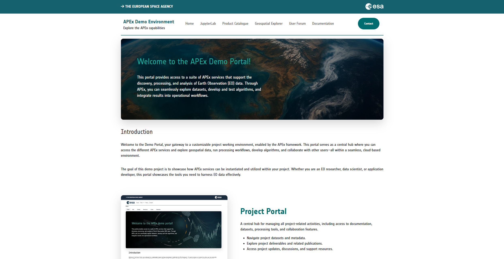

## Overview

The Project Portal will provide a solution designed to support the needs of projects by providing a project website upon
request. The portal, structured on a predefined base template, will offer the flexibility to further customise the
overall user experience. Beyond the initial theming options, the service incorporates a Drupal Content Management
System (CMS), empowering project members to perform advanced customisations and efficiently manage portal content.

The instantiated project portal will have the option to work in synergy with other services offered within APEx. This
collaborative approach enables projects to extend their portal by instantiating other APEx services, such as a
[STACcatalogue](catalog.qmd), a [Geospatial Explorer](geospatial_explorer.md), a [User Forum](forum.md), and more, and
linking them to the main project portal, resulting in a dedicated, streamlined project ecosystem.

## Showcase Scenarios

The project portal can bring a lot of value to projects, including:

* **Efficient project dissemination and community engagement**\
  Facilitates the rapid and broad dissemination of project information, ensuring that updates, results, and important
  announcements reach the intended audience quickly and effectively.

* **Professional branding with customisation possibilities**\
  The portal comes with polished, consistent branding out of the box, enhancing the project's credibility and
  professionalism and fostering trust among stakeholders and the public. Additionally, project teams can tailor the
  portal’s appearance to align with specific branding guidelines or aesthetic preferences, creating a unique and
  engaging user experience that reflects the project's identity.

* **Content management and moderation**\
  The portal's robust content management capabilities enable teams to streamline the creation, moderation, and updating
  of content. Advanced features like content moderation workflows and version control ensure that all shared information
  is accurate, current, and meets our high-quality standards. The system supports various roles and permissions,
  including administrators and content creators, fostering a self-regulated environment. This empowerment allows project
  teams to manage their content and user access autonomously, thereby enhancing operational efficiency.

## What does APEx offer?

APEx provides a default Drupal installation for your project, including a basic theme. APEx offers basic theming
support, such as changing the color scheme and project logo. Upon creation of your project's portal, an administrator
account will be created, allowing you to invite other project members. Using the built-in content management system,
your project is free to manage the content of the full website.

In addition to providing your project portal, APEx ensures optimal performance and availability through continuous
monitoring. Automated maintenance tasks, such as updates and backups, are conducted to minimize downtime and maintain
data integrity. This approach establishes a robust and dependable environment for users.

By April 2026, the APEx Project Portal service will be integrated into the ESA Network of Resources (NoR). Until these
services are onboarded, projects can reach out to the APEx team to explore how we can support their hosting needs. APEx
also manages DNS setup, ensuring your project’s website is accessible on the internet without any additional technical
burden.

This comprehensive service allows projects to focus on content creation and management while APEx takes care of the
technical aspects, making it a valuable and efficient solution for project dissemination needs.

## What software is used by APEx?

For the project portal service, APEx uses the [Drupal](https://www.drupal.org/) framework. Drupal is an open-source
platform for creating and managing web content. In addition to its extensive content management features, it also allows
for detailed customization.

## Examples

@tbl-portal-examples showcases example projects that use the APEx Project Portal:

| Project                         | URL                                                      |
| :------------------------------ | :------------------------------------------------------- |
| APEx                            | [https://apex.esa.int/](https://apex.esa.int/)           |
| APEx (Demo)                     | [https://demo.apex.esa.int/](https://demo.apex.esa.int/) |
| World Ecosystem Extent Dynamics | [https://weed.apex.esa.int/](https://weed.apex.esa.int/) |

: APEx Project Portal - Project Examples {#tbl-portal-examples}{tbl-colwidths="[30,70]"}

## User Documentation

For a step-by-step guide on how to use and manage your project portal, refer to the official
[Project Portal User Guide](../guides/project_portal/)

:::{.callout-tip}

## Stay Tuned

Additional information will be shared on this page as the project progresses.
:::
