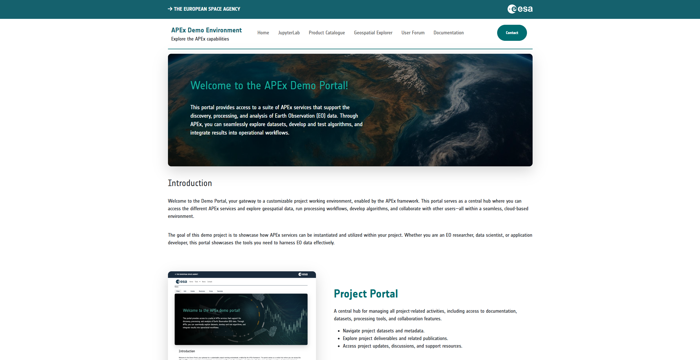

## Overview

The Project Web Portal will provide a solution designed to support the needs of projects by providing a project website upon
request. The portal, structured on a predefined base template, will offer the flexibility to further customise the
overall user experience. Beyond the initial theming options, the service incorporates a Drupal Content Management
System (CMS), empowering project members to perform advanced customisations and efficiently manage portal content.

The instantiated project web portal will have the option to work in synergy with other services offered within APEx. This
collaborative approach enables projects to extend their portal by instantiating other APEx services, such as a
[STACcatalogue](catalog.qmd), a [Geospatial Explorer](geospatial_explorer.md), a [User Forum](forum.md), and more, and
linking them to the main project web portal, resulting in a dedicated, streamlined project ecosystem.

## Showcase Scenarios

The project web portal can bring a lot of value to projects, including:

* **Efficient project dissemination and community engagement**\
  Facilitates the rapid and broad dissemination of project information, ensuring that updates, results, and important
  announcements reach the intended audience quickly and effectively.

* **Professional branding with customisation possibilities**\
  The portal comes with polished, consistent branding out of the box, enhancing the project's credibility and
  professionalism and fostering trust among stakeholders and the public. Additionally, project teams can tailor the
  portal’s appearance to align with specific branding guidelines or aesthetic preferences, creating a unique and
  engaging user experience that reflects the project's identity.

* **Content management and moderation**\
  The portal's robust content management capabilities enable teams to streamline the creation, moderation, and updating
  of content. Advanced features like content moderation workflows and version control ensure that all shared information
  is accurate, current, and meets our high-quality standards. The system supports various roles and permissions,
  including administrators and content creators, fostering a self-regulated environment. This empowerment allows project
  teams to manage their content and user access autonomously, thereby enhancing operational efficiency.

## What does APEx offer?

APEx provides a default Drupal installation for your project, including a basic theme. APEx offers basic theming
support, such as changing the color scheme and project logo. Upon creation of your project's portal, an administrator
account will be created, allowing you to invite other project members. Using the built-in content management system,
your project is free to manage the content of the full website.

In addition to providing your project web portal, APEx ensures optimal performance and availability through continuous
monitoring. Automated maintenance tasks, such as updates and backups, are conducted to minimize downtime and maintain
data integrity. This approach establishes a robust and dependable environment for users.

By April 2026, the APEx Project Web Portal service will be integrated into the ESA Network of Resources (NoR). Until these
services are onboarded, projects can reach out to the APEx team to explore how we can support their hosting needs. APEx
also manages DNS setup, ensuring your project’s website is accessible on the internet without any additional technical
burden.

This comprehensive service allows projects to focus on content creation and management while APEx takes care of the
technical aspects, making it a valuable and efficient solution for project dissemination needs.

## What software is used by APEx?

For the project web portal service, APEx uses the [Drupal](https://www.drupal.org/) framework. Drupal is an open-source
platform for creating and managing web content. In addition to its extensive content management features, it also allows
for detailed customization.

## Long‑Term Availability and Preservation of Project Portals

In addition to supporting active ESA EO projects, APEx provides a pathway for long‑term availability of project portals
beyond the official project duration. As the APEx Project Environments are being onboarded into the ESA Network of Resources
(NoR), projects will be able to rely on NoR to sustain their portals over time.

### Sustained Hosting Through NoR

The NoR funding can be used to ensure project portals can remain online. When projects request portal hosting through NoR,
they benefit from:

* Operational continuity of the portal after the project ends
* Continued cloud hosting, maintenance, and security updates delivered by APEx service partners
* Continued access for stakeholders, enabling outreach, communication, and follow‑up activities

Projects are therefore encouraged to include portal hosting and maintenance costs in their planning, so the portal can
remain in the NoR‑supported operations after the project’s conclusion.

### Preservation and Retirement Strategy

APEx provides a practical long‑term strategy to ensure that project portals remain accessible while keeping
operational costs manageable:

* As long as NoR funding or project budget is available, portals remain fully operational.
* When funding is exhausted, portals may be taken offline but, if requested, preserved as a retirement snapshot. This ensures\
they can be restored later if needed, without losing the portal’s content or structure.

### Independent Preservation of Project Results

While project portals provide a unified and user‑friendly interface for presenting project outcomes, it is important to
note that the long‑term preservation of project results does not depend on the portal.

All key project outputs, including:

* deliverables
* datasets and derived products
* workflows and pipelines
* algorithms and application packages

are preserved in dedicated ESA‑managed systems, such as:

* the [ESA Project Results Repository (PRR)](https://browser.apex.esa.int/external/eoresults.esa.int/stac?.language=en)
for data and products
* document and deliverable archives managed by ESA
* the [Algorithm Services Catalogue](../propagation/onboarding.md#apex-algorithm-catalogue) for workflows and algorithms

This means that even if a project portal is retired or offline, the authoritative project outputs remain accessible to
the EO community without requiring dedicated hosting resources.

## Examples

@tbl-portal-examples showcases example projects that use the APEx Project Web Portal:

| Project                         | URL                                                                                  |
| :------------------------------ | :----------------------------------------------------------------------------------- |
| APEx                            | [https://apex.esa.int/](https://apex.esa.int/)                                       |
| APEx (Demo)                     | [https://demo.apex.esa.int/](https://demo.apex.esa.int/)                             |
| World Ecosystem Extent Dynamics | [https://esa-worldecosystems.org/](https://esa-worldecosystems.org/)                 |
| EO4SEM                          | [https://eo4sem.apex.esa.int/en](https://eo4sem.apex.esa.int/en)                     |
| EOBPs – Solar Energy            | [https://eobp-energy.apex.esa.int/en](https://eobp-energy.apex.esa.int/en)           |
| EOBPs – Health                  | [https://eobp-health.apex.esa.int/en/home](https://eobp-health.apex.esa.int/en/home) |
| EOBPs- Road and Rail            | [https://eobp-transport.apex.esa.int/en](https://eobp-transport.apex.esa.int/en)     |
| RAVE                            | [https://rave.apex.esa.int/en](https://rave.apex.esa.int/en)                         |

: APEx Project Web Portal - Project Examples {#tbl-portal-examples}{tbl-colwidths="[30,70]"}

## User Documentation

For a step-by-step guide on how to use and manage your project web portal, refer to the official
[Project Web Portal User Guide](../guides/project_portal/)
