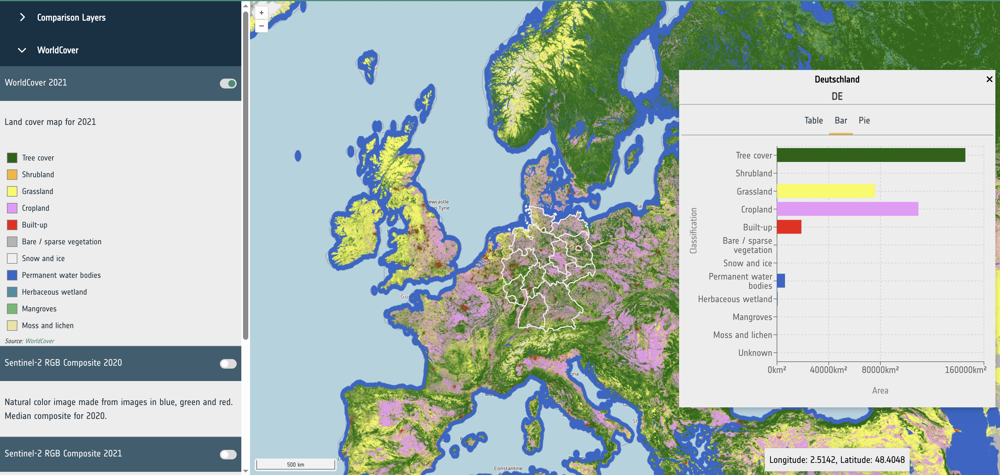
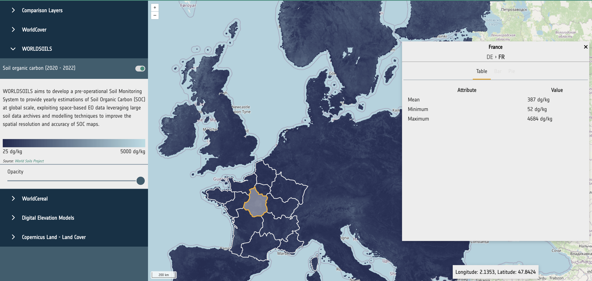

## Requirements

@tbl-datahosting outlines the interoperability guidelines for EO projects and data providers who wish to deliver their
datasets to APEx for integration within the [ESA Project Results Repository (PRR)](https://eoresults.esa.int/) for
long-term preservation and their utilisation within the APEx Project Environments. By fulfilling these requirements,
APEx ensures seamless integration, discoverability, and usability of the datasets across the ESA EO ecosystem,
facilitating broader access and reusability within the EO community.

Most of these requirements focus on standardising dataset metadata, formats, and access methods to ensure compatibility
with existing tools and support their efficient exploitation. In particular, datasets should adhere to well-established
EO data standards and provide consistent, machine-readable metadata descriptions.

APEx supports integration primarily through recognised standards such as STAC (SpatioTemporal Asset Catalogue) and
cloud-native data formats. This ensures that almost any EO dataset can be made available as a ready-to-use resource in
the ESA PRR and used through the APEx tooling.

Overall, the objective is to streamline and simplify the delivery of high-quality, interoperable EO datasets to APEx,
fostering wider adoption and enabling advanced use cases in downstream applications.

:::{#tbl-datahosting}

<table class="requirements">
  <thead>
    <tr>
      <th>ID</th>
      <th>Requirement</th>
      <th>Description</th>
    </tr>
  </thead>
  <tbody>
    <tr>
      <td>DATA-REQ-01</td>
      <td>EO project results with respect to raster data, shall be delivered as cloud-native datasets.</td>
      <td>Where possible, cloud optimized GeoTIFF [@cog] is preferred. For more complex datasets, GeoZarr [@geozarr] and CF-Compliant netCDF [@netcdf] is a good alternative. Use of the still evolving GeoZarr [@geozarr] format requires confirmation by APEx and may result in future incompatibility if the selected flavour is not standardised eventually. Additional recommendations for the usage of file formats within the APEx services are available [below](#file-format-and-metadata-recommendations)</a>.</td>
    </tr>
    <tr>
      <td>DATA-REQ-02</td>
      <td>EO project results with respect to vector data, shall be delivered as cloud-native datasets.</td>
      <td>Small datasets can use GeoJSON [@geojson], FlatGeobuf [@flatgeobuf] or GeoParquet [@geoparquet] are recommended for larger datasets.</td>
    </tr>
    <tr>
      <td>DATA-REQ-03</td>
      <td>EO project results should be accompanied with metadata in a STAC [@stac] format, including applicable STAC extensions.</td>
      <td>The specific STAC profiles will align with the recommendations will align with the recommendations provided in the [Metadata Recommendations](#metadata-recommendations) section.</td>
    </tr>
  </tbody>
</table>

Interoperability requirements for data providers
:::

## File Format and Metadata Recommendations

This section provides recommendations for file formats and accompanying STAC metadata for EO project results delivered
to APEx. The recommendations are organised around three additive use case scenarios. Every data provider should start
with Scenario 1. If data also needs to be visualised, Scenario 2 applies on top. Scenario 3 provides additional
recommendations in case the goal is to visualise the data within the APEx Geospatial Explorer. Projects are encouraged
to consult with the APEx team if their use case does not fit within these guidelines.

The key underlying principle is to use cloud native formats, with adoption rate as a secondary criterion to ensure that
the produced data can reach a broad audience beyond the earth observation community. Although the sections below provide
extra guidance, we refer to the [cloud native geospatial guide](https://guide.cloudnativegeo.org/) for a comprehensive
comparison.

| Scenario | Formats | Builds on |
| :--- | :--- | :--- |
| 1 – Cloud-based Processing | COG, GeoZarr, NetCDF\ GeoParquet, FlatGeobuf, GeoJSON | (baseline) |
| 2 - Visualization | COG, GeoZarr\ GeoJSON, FlatGeobuf | Scenario 1 |
| 3 - Visualization in APEx Geospatial Explorer | COG, GeoZarr\ GeoJSON, FlatGeobuf | Scenario 1 + 2 |

:File Format Scenarios

### STAC Metadata Recommendations

The STAC specification provides a comprehensive and interoperable framework for describing geospatial datasets. Within
APEx, STAC serves as the foundation to enhance the discoverability, interoperability, and integration of data across a
range of platforms, data catalogues, including the ESA Project Results Repository, and tools such as the APEx
Geospatial Explorer.

To enhance interoperability, data providers are advised to consistently use a recommended set of STAC-related extensions
and best practices. These recommendations come from community input and collaboration with other initiatives, like
[EarthCODE](https://earthcode.esa.int/) and [EOEPCA](https://eoepca.org/eoepcaplus/), to ensure consistency across
projects and promote the adoption of best practices.

The following chapters offer a summary of the suggested metadata for the different scenarios. For further details,
please refer to the resources listed below.

- [STAC Best Practices](https://github.com/radiantearth/stac-best-practices/blob/main/README.md)
- [EOEPCA+ Datacube Access Best Practices](https://github.com/EOEPCA/datacube-access/blob/main/best_practices/stac_best_practices.md)
- [ESA PRR Collection Specifications](https://eoresults.esa.int/prr_collection_specifications.html)

### Scenario 1: Cloud-based Processing

This scenario applies to all data providers publishing EO datasets to APEx. It defines the baseline format and metadata
requirements that ensure datasets are cloud-accessible, machine-readable, and compatible with EO processing tools such
as openEO workflows and datacube platforms.

#### Raster Data

Cloud Optimised GeoTIFF (COG) is the most widely supported format for geospatial raster data, and also one of the most
efficient in terms of access costs. It is recommended as the default option to consider when publishing static data products.
When combined with STAC metadata, COG can produce self-describing, FAIR-compliant datasets that are easily consumable by
various services.

##### Generating Cloud Optimised GeoTIFF

If you are not familiar with COG or GeoTIFF generation, it is recommended to format your GeoTIFF files using a recent version
of GDAL to ensure that they are compliant:

```bash
gdal_translate world.tif world_webmerc_cog.tif -of COG
```

##### Organising spatiotemporal multi-band datasets

Many datasets have multiple bands (or 'variables'), or have a date associated with them.
The general recommendation is to store a single band per GeoTIFF file and to create STAC items with one asset per band.
This layout is commonly used by many other datasets and avoids the complexities of multi-band GeoTIFF files, which can be
challenging to use.

An exception to this are the 'RGB' style products, where three bands are used to represent a single image. In this case,
creating a Cloud Optimised GeoTIFF with three bands is an option.

For associating time information, create one GeoTIFF per timestamp, and one STAC item per timestamp. The GeoTIFF format
has not built-in support for conveying time information, but STAC metadata is supporting this very well.

More detailed instructions on how to generate Cloud Optimised GeoTIFF for visualisation purposes are outlined in
[here](#cog-formatting-for-the-apex-geospatial-explorer).

#### Datacubes

##### GeoZarr

[GeoZarr](https://geozarr.org/) [@geozarr] is a format that is gaining traction in the geospatial community, although it
is not yet as widely supported as Cloud Optimised GeoTIFF. Its main advantage lies in its ability to store complex
multi-dimensional datasets that go beyond a simple 4D (x, y, time, bands) structure. Just like COG, Zarr allows for
efficient cloud access.

At the time of writing, there are, however these important caveats:

- GeoZarr aims to define how to store geospatial raster data in Zarr format. This specification is now going through
the standardisation process.
- By design, Zarr allows for many degrees of freedom, which requires the data producer to have a good understanding of
the associated trade-offs. It is not guaranteed that tooling will automatically generate the most appropriate layout and
chunk size for your use case.
- By design, Zarr stores data as separate files in a directory structure, optimising cloud access but making direct
downloads less convenient.

##### NetCDF

NetCDF is a self-describing format with some properties similar to Zarr, but less optimised for cloud access. It can be
useful for exchanging data cubes as single files through traditional methods. However, it is less recommended for convenient
sharing of large datasets, for which either COG or Zarr provide better options.

#### Vector Data

**GeoJSON** [@geojson] is suitable for small vector datasets. For larger datasets, **FlatGeobuf** [@flatgeobuf] is
recommended as it supports efficient streaming of features without requiring the full file to be downloaded, improving
performance significantly. **GeoParquet** [@geoparquet] is also a valid option for large vector datasets, particularly
where columnar access patterns are beneficial.

#### STAC Metadata

When sharing geospatial datasets in cloud-optimised formats, such as Cloud Optimised GeoTIFF (COG), NetCDF, Zarr and
FlatGeobuf, it is essential to embed as much relevant metadata as possible directly within the files. Although these
formats are designed for efficient cloud access, their interoperability potential is enhanced when the files carry rich,
standardised metadata aligned with their respective specifications. Doing so not only improves data reuse by third-party
tools but also enables more reliable automatic inference of STAC metadata during cataloguing or dataset publication.

@tbl-processing-stac offers an overview of the general STAC recommendations for cloud-based processing. For more
details and examples on adding this additional metadata to your results, please consult the specific tools (e.g.
[gdal](https://gdal.org/en/stable/drivers/raster/cog.html), [rasterio](https://rasterio.readthedocs.io/en/stable/), …)
for generating the results.

:::{#tbl-processing-stac}
<table class="requirements-extended">
  <thead>
    <tr>
      <th>ID</th>
      <th>Level</th>
      <th>Requirement</th>
      <th>Description</th>
    </tr>
  </thead>
  <tbody>
    <tr>
      <td>STAC-REC-01</td>
      <td>Collection / Item</td>
      <td>The STAC collection and items should use STAC 1.1 or higher.</td>
      <td></td>
    </tr>
    <tr>
      <td>STAC-REC-02</td>
      <td>Collection</td>
      <td>The STAC collection must follow the [ESA PRR collection specifications](https://eoresults.esa.int/prr_collection_specifications.html).</td>
      <td>This guarantees the collection is compatible for upload and registration in the ESA Project Results Repository.</td>
    </tr>
    <tr>
      <td>STAC-REC-03</td>
      <td>Collection / Item</td>
      <td>Collections must be homogeneous: each item has the same assets and uses the same asset keys.</td>
      <td>Consistent and homogeneous definition of assets simplifies client-side handling and supports datacube generation.</td>
    </tr>
    <tr>
      <td>STAC-REC-04</td>
      <td>Item</td>
      <td>Each item must have at least one asset where the role is set to *data*.</td>
      <td>This allows for accurate identification of assets containing the data.</td>
    </tr>
    <tr>
      <td>STAC-REC-05</td>
      <td>Item</td>
      <td>
      Each asset must include:
        <ul>
          <li>type</li>
          <li>role</li>
          <li>title</li>
          <li>file:size</li>
        </ul>
      Optionally properties:
        <ul>
          <li>file:checksum</li>
        </ul>
      </td>
      <td>These properties help tools and platforms accurately import the dataset. Furthermore, the *file* properties allow
      the ESA PRR to perform extra quality checks.</td>
    </tr>
    <tr>
      <td>STAC-REC-06</td>
      <td>Item</td>
      <td>
        <p>The <a href="https://github.com/stac-extensions/projection">projection extension</a> must be used to identify
        the CRS, raster bounds and shape.</p>
        <p>At minimum the following must be defined:</p>
        <ul>
          <li>*proj:code*</li>
          <li>*proj:bbox*</li>
          <li>*proj:shape*</li>
        </ul>
      </td>
      <td>
        <p>The projection extension ensures that any tools accessing the data can accurately determine key raster
        properties without the performance overhead of inspecting the raster file.</p>
        <p>The choice of CRS should consider application-specific recommendations (e.g. Geospatial Explorer), where the
        use of multiple UTM zones can introduce complexity, performance issues, and limitations in features such as time
        series visualisation and constraints.</p>
        <p>If the goal is to visualise your data through the [APEx Geospatial Explorer](../instantiation/geospatial_explorer.md),
        please consider the projections that are currently supported, as defined in [EXPLORER-REQ-07](./geospatial_explorer.qmd).</p>
      </td>
    </tr>
    <tr>
      <td>STAC-REC-07</td>
      <td>Item</td>
      <td>To incorporate a time dimension, the item must define a *datetime*, *start_datetime* and *end_datetime* at the
      item level. Both properties contain a single value using ISO8601 time intervals.</td>
      <td>
        <p>These properties enable tools to accurately identify the data's temporal dimension, simplifying search and
        filtering within the STAC collection.</p>
        <p>For temporal dimensions, it is recommended to maintain the original level of granularity; data should not be
        aggregated from daily records to a single label unless specifically instructed by the user or noted in the metadata.
        When combining data and overlap exists, the user must indicate the methodology unless indicated in the metadata.</p>
      </td>
    </tr>
    <tr>
      <td colspan="5"><b>Raster Data</b> (COG)</td>
    </tr>
    <tr>
      <td>STAC-REC-08</td>
      <td>Item</td>
      <td>
        <p>The <a href="https://github.com/radiantearth/stac-best-practices/blob/main/best-practices-asset-and-link.md#bands">*bands*</a>
        array must be used to identify band information in the raster, keep the order as identified in the array.</p>
        <ul>
          <li>Use the *name* property, if provided. Alternatively, use *eo:common_name*. As a last resort, use the array
          indices.</li>
          <li>Ensure homogeneous data types across bands, choosing the most precise one.</li>
        </ul>
      </td>
      <td>
        <p>The bands array enables platforms and associated tools to accurately identify and map the various bands within
      the dataset without the need to access or process the underlying data directly.</p>
      </td>
    </tr>
    <tr>
      <td>STAC-REC-09</td>
      <td>Item</td>
      <td>For other dimensions, the datacube extension must be provided.</td>
      <td></td>
    </tr>
    <tr>
      <td>STAC-REC-10</td>
      <td>Item</td>
      <td>
        <p>The <a href="https://github.com/stac-extensions/raster">raster extension</a> must be used to accurately specify
        the following attributes associated with the raster file: </p>
        <ul>
          <li>*raster:spatial_resolution* (if multiple resolutions are provided in the item, otherwise specify it in the
          Item)</li>
          <li>*raster:scale*</li>
          <li>*raster:offset*</li>
          <li>*raster:nodata value*</li>
        </ul>
      </td>
      <td>The raster extension offers valuable information about the dataset, eliminating the need to directly access or
      analyse the data itself. For instance, when visualising, details like scale and offset can help convert raw values
      into real-world figures.</td>
    </tr>
    <tr>
      <td colspan="5"><b>Datacube</b> (GeoZarr, NetCDF)</td>
    </tr>
    <tr>
      <td>STAC-REC-11</td>
      <td>Collection / Item</td>
      <td>
        <p>The <a href="https://github.com/stac-extensions/datacube"></a>datacube extension (v2.x) should be used to
        properly describe the datacube:</p>
        <ul>
          <li>For a single variable: only use *cube:dimensions*</li>
          <li>For multiple variables: *cube:variables* and *cube:dimensions*. Each variable should be a separate datacube,
          no attempt should be made to combine variables automatically.</li>
        </ul>
      </td>
      <td>
        <p>The extension enables correct data parsing into a datacube by the platform or tool.</p>
        <p>A variable can be bands in EO data or meteorological variables like rain or temperature in meteorological data
        sets.</p>
      </td>
    </tr>
  </tbody>
</table>

STAC metadata recommendations for cloud-based processing
:::

### Scenario 2: Visualisation

This scenario applies in addition to [Scenario 1](#scenario-1-cloud-based-processing), when datasets need to be made
available for visualisation purposes, for example, through web-based map viewers or geospatial portals. It extends the
baseline requirements with metadata that enables tools to correctly configure rendering, colour maps, and rescaling
without requiring direct access to the underlying data.

:::{.callout-tip title="Visualisation in APEx Geospatial Explorer"}
If the target visualisation platform is the [APEx Geospatial Explorer](../instantiation/geospatial_explorer.md),
additionally follow the guidelines [Scenario 3](#scenario-3-visualisation-in-apex-geospatial-explorer).
:::

#### STAC Metadata

Next to general recommendations, described in [Scenario 1](#stac-metadata), @tbl-visualisation-stac provides an overview of the STAC recommendations that apply to data visualisation.

:::{#tbl-visualisation-stac}
<table class="requirements-extended">
  <thead>
    <tr>
      <th>ID</th>
      <th>Level</th>
      <th>Requirement</th>
      <th>Description</th>
    </tr>
  </thead>
  <tbody>
    <tr>
      <td>STAC-REC-12</td>
      <td>Item</td>
      <td>
        <p>In the case of categorical datasets,
        <a href="https://github.com/stac-extensions/classification">classification extension</a> is recommended to identify
        the different classes used in the asset. </p>
        <p>For additional visualization support, it is recommend setting the *title* and *color_hint* properties to allow
        external tools, such as the [APEx Geospatial Explorer](../instantiation/geospatial_explorer.md) to properly visualise
        the data.</p>
      </td>
      <td>The  classification extension supports the proper interpretation of categorical data that is included in the
      collection, item or asset.</td>
    </tr>
    <tr>
      <td>METADATA-REC-07</td>
      <td>Item / Asset</td>
      <td>
        <p>To support the visualization of the dataset, the
        <a href="https://github.com/stac-extensions/render">render extension</a> is recommended.</p>
        <p>The render extension allows the definition of the following properties:</p>
        <ul>
          <li>rescale: 2 dimensions array of delimited Min,Max range per band. If not provided, the data will not be rescaled.</li>
          <li>Colormap: that must be applied for a raster band</li>
        </ul>
      </td>
      <td>The render extension supplies rendering tools, like the [APEx Geospatial Explorer](../instantiation/geospatial_explorer.md),
      with key data to auto-configure visualization settings, including rescaling and colour maps.</td>
    </tr>
  </tbody>
</table>

STAC Recommendations for visualisation
:::

### Scenario 3: Visualisation in APEx Geospatial Explorer

This scenario applies in addition to [Scenarios 1](#scenario-1-cloud-based-processing) and
[Scenario 2](#scenario-2-visualisation), when datasets are intended for visualisation in the
[APEx Geospatial Explorer](../instantiation/geospatial_explorer.md) specifically. It adds format-level requirements for
optimal rendering performance in a browser environment, covering tile size, overview pyramids, and interleave settings
for raster data, as well as file size constraints for vector data.

#### File Format Recommendations

@tbl-ge-formats summarises the key formatting guidelines designed to enhance data visualisation in the APEx Geospatial Explorer.

:::{#tbl-ge-formats}
<table class="requirements-extended">
  <thead>
    <tr>
      <th>ID</th>
      <th>Recommendation</th>
      <th>Description</th>
    </tr>
  </thead>
  <tbody>
    <tr>
      <td colspan="5"><b>Raster Data</b> (COG)</td>
    </tr>
    <tr>
      <td>EXPLORER-REC-01</td>
      <td>
        <p>Set the tile size to 256 or 512 pixels by configuring BLOCKSIZE to the appropriate value using gdal.</p>
      </td>
      <td>
        <p>The  specific choice of tile size (BLOCKSIZE) will depend on whether the use case in the GE is for
        visualisation only, or for visualisation and pixel interrogation (data values / charts) with a performance trade
        off considerations.  Please consult our
        [additional recommendations](#cog-formatting-for-the-apex-geospatial-explorer) for specific guidance, noting the
        interaction with interleave method is also relevant.</p>
      </td>
    </tr>
    <tr>
      <td>EXPLORER-REC-02</td>
      <td>
        <p>The dataset should include overviews that meet these criteria:</p>
        <ul>
          <li>Overviews must be created by downsampling the images by factors of two until the dimensions match or fall below the size of a tile.</li>
          <li>Each overview should be tiled as well.</li>
          <li>To comply with the COG specification, place the overview after the main image data.</li>
        </ul>
        <p>You can use the gdal OVERVIEW_RESAMPLING, OVERVIEWS, and OVERVIEW_COUNT settings to generate these overviews.</p>
      </td>
      <td>
        <p>Overviews are essential for performance as they allow quick visualisation of the data on different zoom levels,
        based on resampling at factors .2, 4, 8, 16, 32.   If necessary, factor 2 can be skipped to reduce file
        size (using gdaladdo tool to build overviews), although performance will be impacted at some zoom scales.</p>
        <p>The objective is to strike an optimal balance between the number of overviews and the total file size.</p>
        <p>Please consult our [additional recommendations](#cog-formatting-for-the-apex-geospatial-explorer) for
        specific guidance.</p>
      </td>
    </tr>
    <tr>
      <td>EXPLORER-REC-03</td>
      <td>
        <p>For multi-band data, set INTERLEAVE to BAND with gdal to efficiently render band composites.</p>
      </td>
      <td>
        <p>Band interleaved data is a safe all round choice, but for specific scenarios / use cases, there may be
        performance benefits for pixel interleaved data.  Please refer to @tbl-cog-settings for specific use case
        examples, noting that the combination of tile size (BLOCKSIZE) is also relevant.</p>
      </td>
    </tr>
    <tr>
      <td colspan="5"><b>Vector Formats</b> (GeoJSON, FlatGeobuf, GeoParquet)</b></td>
    </tr>
    <tr>
      <td>EXPLORER-REC-04</td>
      <td>
        <p>GeoJSON data sources should be kept below 5 Megabytes in size per file.</p>
      </td>
      <td>
        <p>GeoJSON is not partially readable, therefore each source will be fetched in entirety at the initial load of
        the Geospatial Explorer. Large sizes and number of sources can be detrimental to the performance of the
        Geospatial Explorer.</p>
        <p>For such data sets consider using a stream-able format such as FlatGeobuf [@flatgeobuf].</p>
      </td>
    </tr>
    <tr>
      <td colspan="5"><b>Tabular Formats</b> (linked charts)</b></td>
    </tr>
    <tr>
      <td>EXPLORER-REC-05</td>
      <td>
        <p>External CSV files can be used as a source for chart data (e.g. time series), linked either to an entire data
        source, or to a specific feature in a vector dataset, whereby the CSV URL is referenced from a field property.
        CSV files would typically contain a date column and one or more data columns which are configured as series in
        a chart.</p>
        <p>CSV files should be kept below 5 Megabytes in size per file.</p>
      </td>
      <td>
        <p>Please note, CSV data is not supported in the ESA Project Results Repository.</p>
      </td>
    </tr>
  </tbody>
</table>

File format recommendations for data visualisation in APEx Geospatial Explorer
:::

#### COG Formatting for the APEx Geospatial Explorer

The following GDAL command implements the recommended settings for Explorer-optimised COG files:

```{bash}
gdal_translate \
  -of COG \
  -co BLOCKSIZE=512 \
  -co INTERLEAVE=BAND \
  -co OVERVIEWS=AUTO \
  input.tif output_cog
```

Alternatively, where a custom set of overviews that skips the x2 level is required, a combination the following
GDAL commands would be used:

```{bash}
gdal_translate input.tif temp.tif \
  -co TILED=YES \
  -co BLOCKXSIZE=512 \
  -co BLOCKYSIZE=512 \
  -co INTERLEAVE=BAND
```

```{bash}
gdaladdo -r average temp.tif 4 8 16 32
```

```{bash}
gdal_translate temp.tif output_cog.tif \
  -of COG \
  -co BLOCKSIZE=512 \
  -co INTERLEAVE=BAND \
  -co COPY_SRC_OVERVIEWS=YES
```

@tbl-cog-settings is based on the principles of accessing cloud-optimised data via web GIS technology.  It is
recommended that the EO project teams test their own sample outputs with the Geospatial Explorer to ascertain specific
performance characteristics before processing full operational pipelines.

:::{#tbl-cog-settings}

<table class="table-normal">
  <thead>
    <tr>
      <td></td>
      <td colspan="2"><b>Settings</b></td>
      <td colspan="3"><b>Geospatial Explorer Use Cases</b></td>
    </tr>
    <tr>
      <th>Dataset Type</th>
      <th>Tile Size</th>
      <th>Interleave</th>
      <th>Single-Band Web Viz</th>
      <th>Colour Composite Web Viz</th>
      <th>Pixel Interrorgation</th>
    </tr>
  </thead>
  <tbody>
    <tr>
      <td>Single-band raster</td>
      <td>512</td>
      <td>N/A</td>
      <td>Best</td>
      <td>N/A</td>
      <td>Poor</td>
    </tr>
    <tr>
      <td>Single-band raster</td>
      <td>256</td>
      <td>N/A</td>
      <td>Good</td>
      <td>N/A</td>
      <td>Best</td>
    </tr>
    <tr>
      <td>RGB (3-band) imagery</td>
      <td>512</td>
      <td>PIXEL</td>
      <td>Best</td>
      <td>Best</td>
      <td>Good</td>
    </tr>
    <tr>
      <td>RGB (3-band) imagery</td>
      <td>256</td>
      <td>PIXEL</td>
      <td>Good</td>
      <td>Good</td>
      <td>Best</td>
    </tr>
    <tr>
      <td>RGB (3-band) imagery</td>
      <td>512</td>
      <td>BAND</td>
      <td>Average</td>
      <td>Good</td>
      <td>Good</td>
    </tr>
    <tr>
      <td>RGB (3-band) imagery</td>
      <td>256</td>
      <td>BAND</td>
      <td>Average</td>
      <td>Average</td>
      <td>Good</td>
    </tr>
    <tr>
      <td>Multispectral (10-20 bands)</td>
      <td>512</td>
      <td>PIXEL</td>
      <td>Good</td>
      <td>Best</td>
      <td>Average</td>
    </tr>
    <tr>
      <td>Multispectral (10-20 bands)</td>
      <td>256</td>
      <td>PIXEL</td>
      <td>Average</td>
      <td>Good</td>
      <td>Good</td>
    </tr>
    <tr>
      <td>Multispectral (10-20 bands)</td>
      <td>512</td>
      <td>BAND</td>
      <td>Best</td>
      <td>Best</td>
      <td>Good</td>
    </tr>
    <tr>
      <td>Multispectral (10-20 bands)</td>
      <td>256</td>
      <td>BAND</td>
      <td>Good</td>
      <td>Good</td>
      <td>Best</td>
    </tr>
    <tr>
      <td>Hyperspectral (e.g. 200+ bands)</td>
      <td>512</td>
      <td>PIXEL</td>
      <td>Poor</td>
      <td>Poor</td>
      <td>Poor</td>
    </tr>
    <tr>
      <td>Hyperspectral (e.g. 200+ bands)</td>
      <td>256</td>
      <td>PIXEL</td>
      <td>Poor</td>
      <td>Average</td>
      <td>Average</td>
    </tr>
    <tr>
      <td>Hyperspectral (e.g. 200+ bands)</td>
      <td>512</td>
      <td>BAND</td>
      <td>Best</td>
      <td>Best</td>
      <td>Average</td>
    </tr>
    <tr>
      <td>Hyperspectral (e.g. 200+ bands)</td>
      <td>256</td>
      <td>BAND</td>
      <td>Good</td>
      <td>Good</td>
      <td>Best</td>
    </tr>
  </tbody>
</table>

Specific use case examples for COG files with interleave method and tile size
:::

#### Statistical Datasets

Statistical datasets can be used to store precomputed statistics for dataset variables based on spatial units, such as
administrative areas. An example is to collect land cover statistics on using boundaries from nomenclature of territorial
units for statistics (NUTS), as shown in the [APEx Geospatial Explorer](https://explorer.apex.esa.int/) (Statistics). The
guidelines in this section are focused on supporting the integration of statistical data for visualisation in the APEx
Geospatial Explorer.

The statistical datasets are expected to be vector layers that are provided in a format that can be parsed to a feature
collection following the GeoJSON [@geojson] specification. Currently tested and supported formats are GeoJSON [@geojson]
and FlatGeobuf [@flatgeobuf]. FlatGeobuf should be used where the statistical data is a large size as this allows for
streaming of the relevant features without having to download the full dataset, increasing performance.

The metadata header of the file should contain the following properties to define which fields on the features in the
dataset should be used for the following purposes.

- identifierKey: The name of the field that stores the unique identifier for each feature.
- nameKey: The name of the field that stores the human-readable name for display.
- levelKey: The name of the field that stores the administrative level number.
- childrenKey: The name of the field that has a comma-separated list of child feature IDs as declared in identifierKey.
Can be the empty string if this is the bottom level.
- attributeKeys: A comma-separated list of field numbers that store the statistical data.
- units: The units as displayed in the UI. This is for UI purposes only and has no effect on the data.
- visualization_hint: A string of histogram, categorised, or continuous used as a hint to the UI to choose a suitable
presentation for the data.

For example, properties in the file metadata that is defined as follows:

- identifierKey: NUTS_ID
- nameKey: NUTS_NAME
- levelKey: LEVL_CODE
- childrenKey: children
- attributeKeys: Trees, Shrubland, Grassland
- visualization_hint: categorised

would use the fields NUTS_ID, NUTS_NAME, … in the data to determine the navigation and display of statistics in the
Geospatial Explorer.  For further guidance, please contact the APEx team through the [APEx User Forum](http://forum.apex.esa.int/).

Datasets that have classifications (such as land use) should have key:value entires consisting of 'name':'value' and an
entry with a key of 'classifications' with a value consisting of a string based comma separated list containing all the
keys for the classifications and a 'total' key with the sum of all other values. This will allow for correctly rendering
bar charts and pie charts.

```{json}
{
  Bare / sparse vegetation: 3349.349614217657,
  Built-up: 18474.280639104116
  Cropland: 155067.6934300016
  Grassland: 140178.79417018566
  Herbaceous wetland: 1612.828666906516
  Mangroves: 479.46053523623897
  Moss and lichen: 499.40601429089236
  Permanent water bodies: 8969.837211370474
  Shrubland: 7342.96093361589
  Snow and ice: 495.7695064816955
  Tree cover: 301783.0035618253
  Unknown: 1.7258467103820294
  total: 638255.1101299465
  classifications: "Tree cover,Shrubland,Grassland,Cropland,Built-up,Bare / sparse vegetation,Snow and ice,
  Permanent water bodies,Herbaceous wetland,Mangroves,Moss and lichen,Unknown"
}
```

{width=75%}

Datasets that do not have classifications (such as a raster showing soil organic carbon) should contain a selection of
the following entries:

- mean
- min
- max

These values will be rendered as a table.

```{json}
{
  mean: 437.94353402030356
  min: 60
  max: 4410
}
```

{width=75%}

#### STAC Metadata

The STAC metadata, as described in [Scenario 1](#stac-metadata) and [Scenario 2](#stac-metadata-1), is sufficient to
support data visualisation in the APEx Geospatial Explorer.
