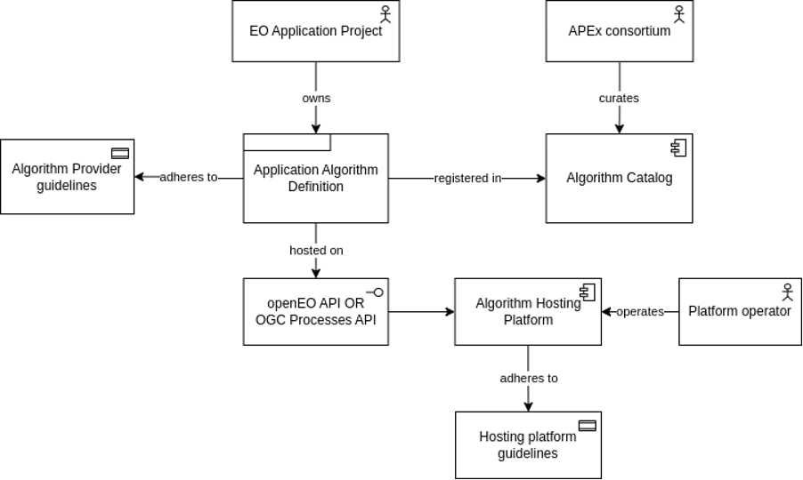

# Definitions & Actors

This section introduces key terms and their meaning in the APEx context, which are crucial for building a common
understanding of the complex ecosystem in which APEx operates. Along with the general definitions, @fig-concepts
visually
demonstrates the interconnections between these concepts.

{#fig-concepts}

## Concepts

### Application Algorithms
(Application) algorithms refer to a heterogeneous group of software that operates on Earth Observation (EO) data to
produce a result. More specifically, APEx was initiated to support the algorithms developed within ESA’s EO application
projects. This, for instance, includes projects in the ‘PEOPLE’ and ‘World’ series. Projects in the ‘Earth Science’
track are supported by the ESA EarthCODE framework.

### Application Algorithm Definition
The application algorithm definition refers to a representation of the algorithm that can be interpreted by an API
and/or processing platform. Typically, it includes a general description of the algorithm along with detailed
information on its parameters, expected output, scientific method, and an overview of the different steps executed
within the algorithm. Examples of algorithm definitions include openEO’s User Defined Processes (UDP) and OGC
Application Package, using the Common Workflow Language (CWL).

### Algorithm Catalogue
The APEx algorithm catalogue is a central register of application algorithm definitions that can be executed on
APEx-compliant algorithm hosting platforms. Curated by APEx, the catalogue relies on automated checks to ensure that
advertised algorithms are available and functional. Whenever a malfunction is detected, this is reported to ESA and the
EO application project consortium, allowing them to determine a proper course of action.

### Hosted Algorithm
To increase uptake and interoperability, APEx aims to enable the execution of application algorithms via standardized
web service APIs. This transitions algorithms from being rather arbitrary pieces of software with potentially complex
requirements, in terms of execution environment, usage, inputs, …, into on-demand services that can readily be invoked
by stakeholders. This transformation primarily involves converting the algorithm into an application algorithm
definition and making it available on an algorithm hosting platform. The transition process into a hosted on-demand
algorithm service is supported by APEx propagation services.

An important boundary condition for hosted algorithms is that they can be executed at a predictable cost for a given set
of inputs.

### Algorithm Hosting Platform
An EO algorithm hosting platform enables the execution of standardized application algorithms, represented by an
application algorithm definition. In APEx, an algorithm hosting platform specifically refers to platforms that support
the openEO and/or OGC Application Package Algorithm standards. For APEx, these platforms are considered existing
providers available through ESA’s Network of Resources (NoR). Examples of such algorithm hosting platforms are the
Copernicus Data Space Ecosystem for openEO or Ellip for OGC Processes.

It is important to note that APEx itself is not an algorithm hosting platform; rather, it promotes the reuse of existing
platforms. A key property of algorithm hosting platforms is their long-term sustainability, beyond the lifetime of a
typical EO application project. This ensures that algorithms can still be executed after the project ends.

The algorithm hosting platform has an important responsibility to ensure the continued availability of hosted
algorithms. This responsibility is detailed in the requirements below, highlighting that the selection of the platform
affects properties such as cost, performance, stability, and the amount of computing resources available to run the
algorithm. Compliance with these requirements does not necessarily imply a high overall quality level across all
aspects, ensuring that EO application projects retain a sufficient degree of freedom in selecting their preferred
platform.

## Actors

### EO Application Project
A project that is executed within the ESA Earth Observation (EO) 'Future-EO1 Segment-2' programme, specifically the
Applications Element of the ‘Earth Science for Society’ block. The Applications Element aims to pioneer innovative and
reliable EO applications and solutions in support of international environment and development policies (e.g. UN 2030
agenda on Sustainable Development). Generally, the more applied science projects, commonly those not directly addressing
Earth system science objectives, are considered application projects.

The ESA EO application project refers to the consortium that is responsible for building the application algorithm. ESA
will indicate if a specific application project must comply with APEx guidelines. When compliance is required, the
consortium can utilize various services offered by APEx. Specifically, the APEx propagation services aim to support the
enhancement of algorithms on a technical and software level and facilitate the transition to hosted algorithms that can
be included in the APEx algorithm catalogue.

It is important to note that during the execution of the project, the application project retains full responsibility
for the final quality of the algorithms and workflows.

### APEx Consortium
The APEx team, comprised of industry experts, operates the various services provided by APEx. To maximize the reuse of
existing resources, the team leverages service offerings within ESA’s Network of Resources (NoR), drawing on the
extensive ecosystem provided by the EO industry.

Although members of the APEx consortium are involved in various EO services registered in NoR, APEx itself is not a new
EO platform.

### Platform Operator
The platform operator plays a crucial role in managing and running the algorithm hosting platform. Their primary
responsibility is to oversee the infrastructure that supports the execution of various algorithms. This includes
providing the necessary computational resources to ensure the smooth and efficient operation of the platform. In
addition to maintaining the technical environment, the platform operator offers user support to assist users in
navigating and utilizing the platform effectively. They are also accountable for meeting the SLAs established for the
platform, ensuring that performance and reliability standards are consistently met. While the operator may be a partner
outside of the APEx consortium, their role is integral to the success of APEx, focusing on both operational management
and user satisfaction.
