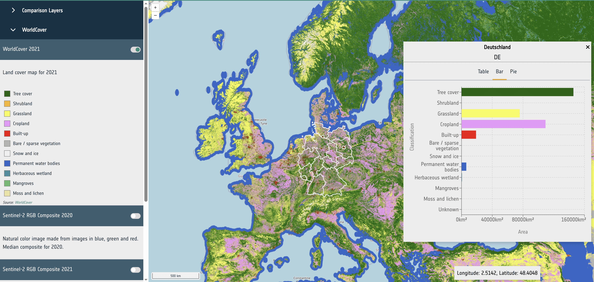
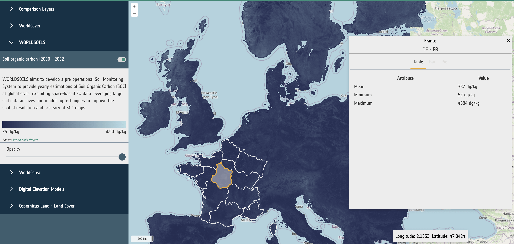

This section outlines the requirements for the interoperability of the APEx Geospatial Explorer services. These
requirements must be met to ensure the correct configuration and operation of a dashboard and its instantiation.

A technical challenge of the Geospatial Explorer service being provided by APEx is that it is to be instantiated on
demand, with functional requirements potentially varying amongst each service.The geospatial explorer makes ue of a well-defined configuration schema, provided in the form of JSON, that outlines the interactive features and
data sources to be used.

This approach allows APEx to define and update the schema required in the interoperability guidelines, which will
then enables requesters of the service to configure the Geospatial Explorer on an individual project level with minimal
external intervention.

The schema is versioned as it will change throughout the APEx project as the functional capabilities of the
Geospatial Explorer matures. This does allow for improvements and extra features to be easily added to the application,
and best practices shall be followed to avoid any breaking changes between versions.


## Requirements

@tbl-geoexplorer outlines the requirements for configuring an instance of the Geospatial Explorer application.

+-----------------+------------------------------------------------------------------------------------------------------------------------------------------------------------------------------------------------------------------------------------------------------------------------------------+-----------------------------------------------------------------------------------------------------------------------------------------------------------------------------------------------------------------------------------------------------------------------------------------------------------------------------------------------------------------+
| ID              | Requirement                                                                                                                                                                                                                                                                        | Description                                                                                                                                                                                                                                                                                                                                                     |
+=================+====================================================================================================================================================================================================================================================================================+=================================================================================================================================================================================================================================================================================================================================================================+
| EXPLORER-REQ-01 | Configuration of the Geospatial Explorer shall adhere to the provided [JSON schema](#configuration-schema).                                                                                                                                                                        | The application is configured through a hosted JSON object which is fetched when the client-side application loads. For the application to correctly render, a valid configuration JSON that follows the outlined schema must be provided pre-instantiation. During early development the schema will be subject to change and provided with limited validation.|
+-----------------+------------------------------------------------------------------------------------------------------------------------------------------------------------------------------------------------------------------------------------------------------------------------------------+-----------------------------------------------------------------------------------------------------------------------------------------------------------------------------------------------------------------------------------------------------------------------------------------------------------------------------------------------------------------+
| EXPLORER-REQ-02 | Raster sources defined within the config shall be provided as either:                                                                                                                                                                                                              |  The use of these formats ensures that raster data can be visualized using widely recognized and well-established standards.                                                                                                                                                                                                                                    |
|                 |                                                                                                                                                                                                                                                                                    |                                                                                                                                                                                                                                                                                                                                                                 |
|                 | - A well formed URL to a hosted Cloud Optimised GeoTiff (COG) [@cog].                                                                                                                                                                                                              |                                                                                                                                                                                                                                                                                                                                                                 |
|                 | - A WMS [@wms] or WMTS [@wmts] endpoint following the relevant OGC specifications.                                                                                                                                                                                                 |                                                                                                                                                                                                                                                                                                                                                                 |
|                 | - A template URL following the XYZ(*) format serving PNG or JPEG tiles .                                                                                                                                                                                                           |                                                                                                                                                                                                                                                                                                                                                                 |
+-----------------+------------------------------------------------------------------------------------------------------------------------------------------------------------------------------------------------------------------------------------------------------------------------------------+-----------------------------------------------------------------------------------------------------------------------------------------------------------------------------------------------------------------------------------------------------------------------------------------------------------------------------------------------------------------+
| EXPLORER-REQ-03 | Vector sources defined within the config shall be provided as either:                                                                                                                                                                                                              |  The use of these formats ensures that vector data can be visualized using widely recognized and well-established standards.                                                                                                                                                                                                                                    |
|                 |                                                                                                                                                                                                                                                                                    |                                                                                                                                                                                                                                                                                                                                                                 |
|                 | - A well formed URL to a valid GeoJSON [@geojson] resource.                                                                                                                                                                                                                        |                                                                                                                                                                                                                                                                                                                                                                 |
|                 | - A public WFS [@wfs] or OGC API Features [@ogc_features] endpoint following the relevant OGC specifications.                                                                                                                                                                      |                                                                                                                                                                                                                                                                                                                                                                 |
|                 | - A well formed URL to a valid FlatGeobuf [@flatgeobuf]  resource.                                                                                                                                                                                                                 |                                                                                                                                                                                                                                                                                                                                                                 |
+-----------------+------------------------------------------------------------------------------------------------------------------------------------------------------------------------------------------------------------------------------------------------------------------------------------+-----------------------------------------------------------------------------------------------------------------------------------------------------------------------------------------------------------------------------------------------------------------------------------------------------------------------------------------------------------------+
| EXPLORER-REQ-04 | All external sources shall be publicly available.                                                                                                                                                                                                                                  | Currently the application does not support fetching sources from hosts that require authentication.                                                                                                                                                                                                                                                             |
+-----------------+------------------------------------------------------------------------------------------------------------------------------------------------------------------------------------------------------------------------------------------------------------------------------------+-----------------------------------------------------------------------------------------------------------------------------------------------------------------------------------------------------------------------------------------------------------------------------------------------------------------------------------------------------------------+
| EXPLORER-REQ-05 | All external sources shall be available utilising the HTTPS protocol.                                                                                                                                                                                                              | It is best practice to utilise HTTPS where possible. Whilst not as of yet blocked specifically, non-secure resources may not function correctly.                                                                                                                                                                                                                |
+-----------------+------------------------------------------------------------------------------------------------------------------------------------------------------------------------------------------------------------------------------------------------------------------------------------+-----------------------------------------------------------------------------------------------------------------------------------------------------------------------------------------------------------------------------------------------------------------------------------------------------------------------------------------------------------------+
| EXPLORER-REQ-06 | All datasets shall be projected to CRS EPSG:3857 (Web Mercator).                                                                                                                                                                                                                   | Other projections may work but will not be explicitly supported in the initial versions of the application. Support for these projections will be considered and reviewed on a case-by-case basis.                                                                                                                                                              |
+-----------------+------------------------------------------------------------------------------------------------------------------------------------------------------------------------------------------------------------------------------------------------------------------------------------+-----------------------------------------------------------------------------------------------------------------------------------------------------------------------------------------------------------------------------------------------------------------------------------------------------------------------------------------------------------------+
| EXPLORER-REQ-07 | Legends should be configured by providing:                                                                                                                                                                                                                                         | This guideline ensures that the legend is fully compatible with the visualisation library used in the Geospatial Explorer.                                                                                                                                                                                                                                      |
|                 |                                                                                                                                                                                                                                                                                    |                                                                                                                                                                                                                                                                                                                                                                 |
|                 | - An inline configuration using either the 'Swatch' or 'Gradient' outlined in the schema.                                                                                                                                                                                          |                                                                                                                                                                                                                                                                                                                                                                 |
|                 | - A URL to a browser supported image resource (PNG, JPEG, SVG).                                                                                                                                                                                                                    |                                                                                                                                                                                                                                                                                                                                                                 |
|                 | - A WMS [@wms] getLegendGraphic request (If supported by a WMS source).                                                                                                                                                                                                            |                                                                                                                                                                                                                                                                                                                                                                 |
+-----------------+------------------------------------------------------------------------------------------------------------------------------------------------------------------------------------------------------------------------------------------------------------------------------------+-----------------------------------------------------------------------------------------------------------------------------------------------------------------------------------------------------------------------------------------------------------------------------------------------------------------------------------------------------------------+
| EXPLORER-REQ-08 | Statistical datasets should be configured by providing public URLs to either: GeoJSON [@geojson] or FlatGeobuf [@flatgeobuf].                                                                                                                                                      | The statistics feature is complex due to the architecture of the Geospatial Explorer. One or more files containing vector features that describe an area and the relevant statistics for the area can be added to the configuration of an explorer instance. These features require a specific structure of properties that can be found in the documentation.  |
+-----------------+------------------------------------------------------------------------------------------------------------------------------------------------------------------------------------------------------------------------------------------------------------------------------------+-----------------------------------------------------------------------------------------------------------------------------------------------------------------------------------------------------------------------------------------------------------------------------------------------------------------------------------------------------------------+
: Interoperability requirements for the Geospatial Explorer application {#tbl-geoexplorer}{tbl-colwidths="[25,75]"}

(*) The XYZ approach refers to a de facto API standard for URL structuring (Z = zoom level, X and Y = grid references). While there is no dedicated specification for XYZ, it is widely used (e.g., [OpenStreetMap](https://wiki.openstreetmap.org/wiki/Raster_tile_providers)).

## Format Specification & Guidelines

### Cloud Optimized GeoTiff (COG)

When generating Cloud Optimised GeoTiffs, it is recommended to use the GoogleMapsCompatible tiling scheme—typically 256x256 pixel tiles aligned to a global grid—and to store the image in the Web Mercator projection (EPSG:3857). The BitsPerSample field must accurately reflect the data format. Overviews are essential for performance and should be generated using downsampling by factors of two until the image dimensions are the size of a tile or smaller. These overviews should also be tiled and placed after the main image data to conform with the COG specification. An example command line invocation using GDAL would be:
```
gdal_translate <src> <dest> -of COG -co TILING_SCHEME=GoogleMapsCompatible
```

### Statistics (Vector Layers)

The statistics feature expects vector layers that are provided in a format that can be parsed to a feature collection following the [GeoJSON specification](https://datatracker.ietf.org/doc/html/rfc7946). Currently tested and supported formats are GeoJSON[@geojson] and FlatGeobuf[@flatgeobuf].
FlatGeobuf[@flatgeobuf] should be used where the statistical data is a large size as this allows for streaming of the relevant features without having to download the full dataset, increasing performance.

Statistics should be contained within the properties entry of each feature. Each feature must contain the following properties:

  * `id` - A short unique id string.
  * `name` - A description label for the feature to be shown to users.
  * `level` - An integer that describes the features geographical hierarchy. This should be contigious with parent and child features.
  * `children` - A string based comma seperated list containing the `id` of all child features.

Datasets that have classifications (such as land use) should have key:value entires consiting of 'name':'value' and an entry with a key of 'classifications' with a value consisting of a string based comma seperated list containing all the keys for the classifications and a 'total' key with the sum of all other values. This will allow for correctly rendering bar charts and pie charts.

```
{
  Bare / sparse vegetation: 3349.349614217657,
  Built-up: 18474.280639104116
  Cropland: 155067.6934300016
  Grassland: 140178.79417018566
  Herbaceous wetland: 1612.828666906516
  Mangroves: 479.46053523623897
  Moss and lichen: 499.40601429089236
  Permanent water bodies: 8969.837211370474
  Shrubland: 7342.96093361589
  Snow and ice: 495.7695064816955
  Tree cover: 301783.0035618253
  Unknown: 1.7258467103820294
  total: 638255.1101299465
  classifications: "Tree cover,Shrubland,Grassland,Cropland,Built-up,Bare / sparse vegetation,Snow and ice,
  Permanent water bodies,Herbaceous wetland,Mangroves,Moss and lichen,Unknown"
}
```

{width=75%}

Datasets that do not have classifications (such as a raster showing soil organic carbon) should contain a selection of the following entries:
 - mean
 - min
 - max

These values will be rendered as a table.

```
{
  mean: 437.94353402030356
  min: 60
  max: 4410
}
```

{width=75%}

## Configuration Schema

The service configuration will be based on a schema that provides administrators with the expected structure and
contents of the configuration. Taking this approach enables:

* Automated and dynamic instantiation of the service with differing functionality.
* Configuration validation.
* Definition of a “contract” for easier documentation of features and their configuration.

The sections below briefly outline the structure of the configuration schema and provide a preliminary description of
each field/property within. The schema currently consists of four top-level fields and all properties are written in
camel case.

### Layout - `layout`

An object with properties that modify the elements that the application will render. These properties and elements
relate specifically to non-geospatial layout components, like navigation and footer.

Currently supported properties:

#### Navigation - `navigation`

An object which supports two properties:

* `logo`: A URL string that points to a logo image asset.
* `title`: A string to be used as a title for the application.

### Interface Groups - `interfaceGroups`

An optional array of strings to be used as names/keys. This is currently used to configure the grouping of layer UI
elements, such as the layer cards. This will be expanded in later versions.

### Exclusivity Sets - `exclusivitySets`

An optional array of strings to be used as names/keys. This is currently not in use but is a placeholder for future
work.

### Sources - `sources`

An array of objects. Each object outlines a particular data source to be configured for display within the application,
with properties detailing both the geospatial and user interface configuration.

Currently supported properties within a source object are:

#### Name - `name`

A string that is used to identify layers in both the user interface and OpenLayers state

#### Is Active - `isActive`

A boolean. Determines if a layer is currently shown on the map. Setting this to true will show the layer on the map when
the application loads.

#### Layout - `layout`

An object to determine which interface elements are rendered for the layer. Supports two properties:

##### Layer Card - `layerCard`

An object that will determine if a layer card should be rendered for this layer and what other interface elements should
be rendered within the card. This is currently the main way to interact with a layer within the application. The layer
card can show a toggle for the layer, a selection of buttons or controls for the layer, legends and attribution text.
This currently supports the following properties:

* `toggleable`: A boolean that determines if a toggle switch to enable/disable the layer should be rendered.
* `controls`: An optional array of strings that configure which buttons to render in the layer card for interaction with
  the layer.
* `legend`: An optional object that can be configured to show static or dynamic legend elements within the layer card
  when active.

##### Interface Group - `interfaceGroup`

An optional string that is used to identify which interface group this layer belongs to.

#### Metadata - `meta`

An objectg that contains information describing the data source. This is generally used for information that would be used in multiple places across the application such as: units used to describe data values, the minimum and maximum value for use in UI/Visualisation calculations, attribution etc.

This currently supports the following properties:

* `attribution`: An optional object to render some text or a link for use with attribution of layer datasets.
* `min`: An interger for the lower limit to use for data values when calculating UI elements such as legends, statistics, colour ramps.
* `max`: An interger for the upper limit to use for data values when calculating UI elements such as legends, statistics, colour ramps.
* `units`: An optional string that desribes the units of any values derived from the data. Used in legends and statistics panels.
* `description`: An optional string that describes the dataset.
* `startColor`: A string describing a valid hex or RGB/A colour value. This is used to render colour ramps and legends.
* `categories`: An array of objects that contains a `lablel` (string) property and a `color` (string) property. Describes classifications within datasets such as land usage. Used to create swatch legends and statistics visualisation.


#### Data - `data`

An array of objects that configures the data to be displayed in the layer. If the length is more than one a layer group will be created and all sources will be treated as one layer.

Each object currently supports the following properties:

* `url`: A required URL string that points to the dataset's publicly available resource.
* `format`: A required string that identifies what kind of dataset is requested. This can be one of the following: `wms`, `wmts`, `cog`, `xyz`, `wfs` or `geojson`.
* `type`: An optional string that can be used to further define the type of layer the source represents. e.g data, statistical, swipe
* `layers`: Only required for sources of format: `wms` and `wmts`. A string that describes the layer to be requested from
  the external service.
* `typeName`: Only required for sources of format: `wfs`. A string that describes the type to be requested from the
  external service.
* `zIndex`: Optional integer that determines rendering order within the map. It can be used to override the default
  rendering of Open Layers.
* `exclusivitySet`: Optional string used to identify a group of other layers that should be disabled when this layer is
  enabled. They must share the same string.
* `projection`: Optional EPSG code string that describes the projection of the dataset to Open Layers. If the projection
  is supported (and doesn't match the map's configured projection), it will attempt to reproject the data.
* `style`: Open Layers style object that is passed through to the library to modify the rendering of the layer within
  the map.
* `baseSources`: A required array of strings for sources with a `swipe` type. Each string should match the name property of another source. Describes the layers to be render on the "left" side of a comparison layer.
* `clippedSource`: A required string for sources with a `swipe` type. The string should match the name property of another source. Describes the layer to be render on the "right" side of a comparison layer.
* `images`: Only required for sources of format: `cog`. An array of objects that contain a URL property pointing to a COG
  resource. Replaces the 'url' property for this source type. Allows loading multiple GeoTiffs into one layer.
* `normalise`: Only required for sources of format: `cog`. Boolean that configures the map to normalise the raster pixel
  values to between 0 and 1. False by default.
* `isBaseLayer`: Optional boolean that determines if the layer should be treated as a base layer. Base layers are always active and cannot be toggled.
* `level`: A required integer for sources of type `statistical`. Ideally starting at 0, this integer describes the hierachy of statistical sources. Higher integers should represent more complex and granular vector datasets. Used to provide the statistics feature UI and mantain performance for large vector datasets.

## Example Configurations

Numerous example configurations can be found in the [APEx Geospatial Explorer Configurations](https://github.com/ESA-APEx/apex_geospatial_explorer_configs) repository on GitHub.
