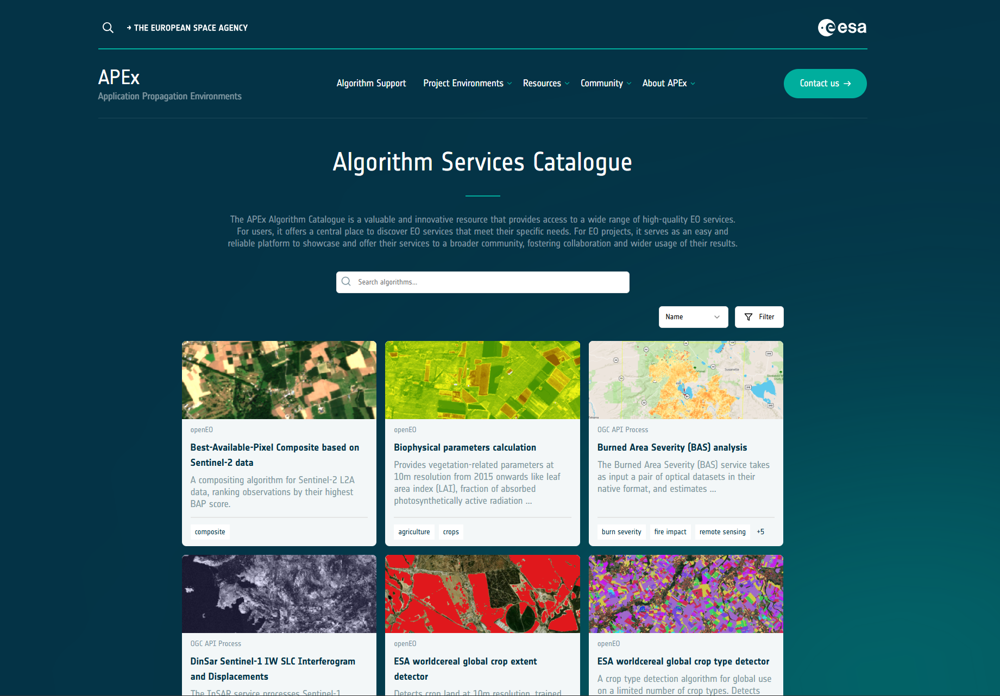

APEx offers algorithm onboarding support as part of its propagation services to ensure that project workflows and
algorithms remain accessible to the EO community beyond the project’s completion. This service not only aims to sustain
and promote the use of algorithms developed during ESA projects, ensuring their longevity and continued utilisation, but
also ensures alignment with the FAIR and open science data principles. This is achieved through the implementation of
APEx [Interoperability and Compliance Guidelines](../interoperability/index.md) and by registering the onboarded
services in the [APEx Algorithm Services Catalogue](#apex-algorithm-services-catalogue) for broader visibility and
accessibility.

For the engagement with stakeholders of the algorithm, APEx collaborates closely with initiatives such as
the [Stakeholder Engagement Facility (SEF)](https://esa-sef.eu/). Such initiatives provide outreach and training towards
users to maximise the uptake of the onboarded algorithms.

## Support Overview

The APEx Algorithm Onboarding service provides support in several key areas. The support can be tailored to the needs
of the project and can include one or more of the following components:

* **[Algorithm Hosting Platform Onboarding](#hosting-platform-onboarding-support)**\
  Assistance in selecting and onboarding the algorithm to an [APEx-compliant hosting platform](./platforms.md), ensuring
  that the algorithm is available for execution as an on-demand service.
* **[APEx Algorithm Services Catalogue Integration](#apex-algorithm-services-catalogue)**\
  Guidance on how to integrate the hosted algorithm into the [APEx Algorithm Services Catalogue](https://algorithm-catalogue.apex.esa.int/),
  making it discoverable and accessible to the EO community.
* **[Automated Testing and Benchmarking](#automated-testing-and-benchmarking)**\
  Provision of automated testing and benchmarking services to ensure the algorithm remains functional and accessible over
  time.

### Hosting Platform Onboarding Support

APEx can help to identify the different hosting environments that the project can choose from based on criteria such as
the chosen APEx-compliant standard (openEO or OGC API Processes) or the availability of specific datasets and processing
capabilities that are required by the algorithm. If applicable, APEx can also assist in the hosting environment
onboarding process, ensuring that your algorithm is available for execution on the selected platform and ready for
further integration into the APEx [Algorithm Services Catalogue](#apex-algorithm-services-catalogue).

:::{.callout-tip}
A full list of the known APEx-compliant algorithm hosting platforms is
available [here](./platforms.md).
:::

### APEx Algorithm Services Catalogue

Through comprehensive guidelines and documentation, projects can seamlessly integrate their hosted services in the
APEx [Algorithm Services Catalogue](https://algorithm-catalogue.apex.esa.int/). This process facilitates easy browsing
and access to available algorithms, fostering collaboration and innovation within the EO community.

The APEx [Algorithm Services Catalogue](https://algorithm-catalogue.apex.esa.int/) allows visitors to discover and
select algorithms for subsequent execution on the corresponding APEx-compliant hosting environment.

::: {.callout-note title="Disclaimer"}
APEx relies on the APEx-compliant algorithm hosting environments for algorithm execution and the provisioning of the
corresponding cloud resources. Users wishing to execute an algorithm will need a valid account on the relevant hosting
platform or make a request through [ESA's Network of Resources (NoR)](https://portfolio.nor-discover.org/).
:::

Stay tuned for more detailed instructions on how to execute an algorithm through the APEx Algorithm Services Catalogue.

### Automated Testing and Benchmarking

To ensure service integrity, APEx conducts periodic, automated testing and benchmarking in close collaboration with the
respective algorithm developers. This ensures that the algorithms remain functional and accessible over time. APEx
offers this testing service free of charge, reducing the maintenance burden on project teams.

Since the proper functioning of services depends on various external factors, APEx asks project teams to define at least
one test scenario to verify that the service remains operational. This approach provides several benefits for all
parties involved:

* Algorithm maintainers receive notifications about issues without needing to build their own testing and monitoring
  systems.
* Algorithm hosting platforms are similarly notified of any problems, helping them address issues early.
* APEx is able to maintain a catalogue of working services, which strengthens user trust and increases the uptake of
  reliable services.
* Service providers on platforms with SLAs, such as those available on the NoR, can identify and resolve potential
  issues before users report SLA breaches. Algorithm hosting platforms may also use the automated test scenarios as part
  of their own reporting process for on-demand service performance.

APEx does not have a reporting procedure towards the NoR or a requirement to report on the state of a service or a
potential SLA breach. Service providers are not forced to take action in case of a negative test. APEx may simply use a
visual clue to indicate a (temporary) issue or may hide/remove services as part of regular catalogue housekeeping when
the service provider indicates that the problem will not be resolved or is simply no longer reachable.

To run the defined tests, APEx also needs permission from the hosting platform and an account with sufficient credits.
Collaboration of the platform may be required to fulfil this requirement.

## Considerations and Project Responsibilities

### Algorithm Maintenance

While APEx ensures the long-term availability of the service within the catalogue, the creation, maintenance, and
updating of the algorithm remain the responsibility of the original developer or the open-source community. It should be
noted, however, that the APEx service solutions (openEO UDP and Application Package) already aim to limit the need for
algorithm maintenance.

### Algorithm Execution

Algorithm execution is carried out on one of the respective APEx-compliant algorithm hosting platforms. By default, APEx
does not provide direct access to processing resources on these platforms. The user is in charge of ensuring platform
access modalities, while some platforms, such as CDSE, may offer free credit tiers. Moreover, projects can request
subscriptions to hosting platforms or credits for DPaaS-based algorithm execution through
ESA’s [Network of Resources (NoR)](https://portfolio.nor-discover.org/). When resources are requested for a specific
service, onboarded to the ESA NoR, APEx can facilitate access to cloud processing resources on the corresponding
platform as a central gateway and catalogue of federated services.

In the long term, APEx plans to integrate the execution of services through its [APEx Geospatial Explorer](https://explorer.apex.esa.int/),
simplifying the execution of onboarded services. However, it’s important to note that even with this user-friendly interface,
users will still need to have access to the necessary processing resources on that platform.

### Large-scale Data Processing

Once the algorithm has been integrated into the APEx [Algorithm Services Catalogue](#apex-algorithm-services-catalogue),
users can leverage it for large-scale data processing. For such activities, APEx offers additional support
for [algorithm upscaling](upscaling.md).

## Onboard Your Algorithm on the [APEx Algorithm Services Catalogue](#apex-algorithm-services-catalogue)

Onboarding your algorithm to the APEx Algorithm Services Catalogue is a straightforward process. Follow these
steps to get started:

1. **Host Your Algorithm**: Ensure your algorithm is hosted on an [APEx-compliant platform](./platforms.md). If you need
assistance in selecting a suitable platform, refer to the
[Hosting Platform Onboarding Support](#hosting-platform-onboarding-support) section.
2. **Prepare Your Algorithm Record**: Create a detailed record of your algorithm service, including its functionalities,
input/output specifications, and any relevant metadata. This record should adhere to the guidelines provided in the
[APEx Algorithm Services Catalogue](https://esa-apex.github.io/apex_algorithms/catalogue.html).
3. **Submit a Pull Request**: To officially onboard your algorithm service, submit a pull request (PR) to the
[APEx Algorithms GitHub Repository](https://github.com/ESA-APEx/apex_algorithms).
4. **Review and Approval**: The APEx team will review your submission. If everything is in order, your algorithm service
will be approved and added to the catalogue.
5. **Catalogue Integration**: Once approved, your algorithm service will be listed in the
[APEx Algorithm Services Catalogue](https://algorithm-catalogue.apex.esa.int/), making it accessible to
the EO community.
